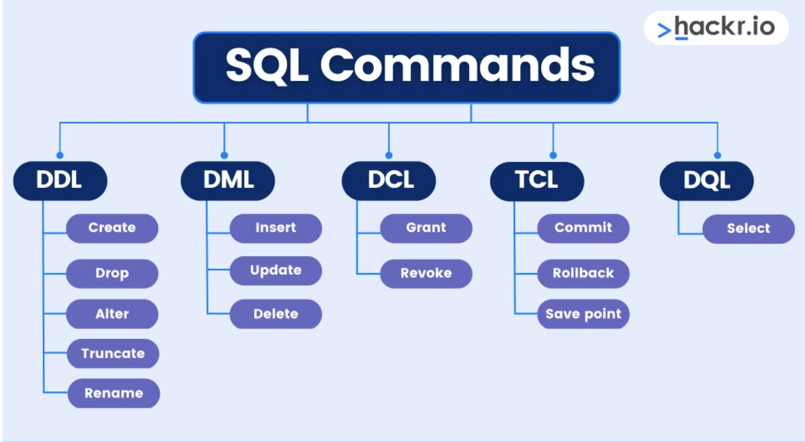

# 2.Basics

**SQL (Structured Query Language):**

SQL, or Structured Query Language, is a programming language used for managing and manipulating relational databases. It allows users to interact with databases by defining and manipulating data. SQL is essential for tasks such as querying databases, updating records, inserting new data, and creating or modifying database structures.

**Example:**

Let's consider a simple scenario of a library database. We want to retrieve information about books that are available in the library.

```sql
-- SQL Query to Retrieve Book Information
SELECT BookTitle, Author, PublicationYear
FROM Books
WHERE Status = 'Available';
```

Explanation:

- `SELECT`: This keyword is used to specify the columns that you want to retrieve from the database.

- `BookTitle, Author, PublicationYear`: These are the column names we want to retrieve information from.

- `FROM Books`: Specifies the table (in this case, "Books") from which to retrieve the data.

- `WHERE Status = 'Available'`: This part filters the results to only include books with the status "Available."

In simple terms, this SQL query is like asking the database: "Give me the titles, authors, and publication years of all available books from the 'Books' table."

The database will then respond with a list of books that match the specified conditions. SQL queries are powerful tools for managing and extracting information from databases, and they can become more complex depending on the requirements of the task at hand.

## What Can SQL do?

- SQL can execute queries against a database.
- SQL can retrieve data from a database.
- SQL can insert records in a database.
- SQL can update records in a database.
- SQL can delete records from a database.
- SQL can create new databases.
- SQL can create new tables in a database.
- SQL can create stored procedures in a database.
- SQL can create views in a database.
- SQL can set permissions on tables, procedures, and views.

## SQL Data Types

| Data Type         | Description                                         | Length           |
|-------------------|-----------------------------------------------------|------------------|
| INT               | Integer                                             | -                |
| VARCHAR(size)     | Variable-length character string                    | 1 to 65,535 bytes|
| CHAR(size)        | Fixed-length character string                       | Up to 255 bytes  |
| TEXT              | Variable-length text                                | Up to 65,535 bytes|
| DATE              | Date (YYYY-MM-DD)                                   | -                |
| TIME              | Time (HH:MM:SS)                                     | -                |
| DATETIME          | Date and time (YYYY-MM-DD HH:MM:SS)                 | -                |
| TIMESTAMP         | Timestamp                                           | -                |
| FLOAT             | Floating-point number                               | -                |
| DOUBLE            | Double-precision floating-point number              | -                |
| DECIMAL(p, s)     | Fixed-point number                                  | -                |
| BOOLEAN           | Boolean value (0 or 1)                              | -                |
| ENUM(val1, val2)  | Enumeration of possible values                      | -                |
| SET(val1, val2)   | Set of possible values                              | -                |
| BLOB              | Binary Large Object (for binary data)               | Up to 65,535 bytes|




DDL, or Data Definition Language, commands in SQL are used to define the structure of a database. These commands enable the creation, modification, and deletion of database objects, such as tables and indexes. Here are some common DDL commands along with examples:
## DDL

### 1. **CREATE:**
The `CREATE` command is used to create a new database object, such as a table.

**Example: Creating a Table**
```sql
CREATE TABLE employees (
    employee_id INT PRIMARY KEY,
    first_name VARCHAR(50),
    last_name VARCHAR(50),
    hire_date DATE
);
```
This example creates a table named "employees" with columns for employee ID, first name, last name, and hire date.

### 2. **ALTER:**
The `ALTER` command is used to modify the structure of an existing database object.

**Example: Adding a Column to a Table**
```sql
ALTER TABLE employees
ADD department VARCHAR(50);
```
This example adds a new column named "department" to the existing "employees" table.

### 3. **DROP:**
The `DROP` command is used to delete a database object, such as a table or database.

**Example: Dropping a Table**
```sql
DROP TABLE employees;
```
This example deletes the "employees" table and removes all data associated with it.

### 4. **TRUNCATE:**
The `TRUNCATE` command is used to remove all records from a table but keep the table structure for future use.

**Example: Truncating a Table**
```sql
TRUNCATE TABLE employees;
```
This example removes all records from the "employees" table, leaving the table structure intact.

### 5. **RENAME:**
Although not supported in all database systems, the `RENAME` command is used to rename an existing database object.

**Example: Renaming a Table**
```sql
-- Syntax varies by database system
RENAME TABLE old_table_name TO new_table_name;
```
This example illustrates the concept, but syntax may differ between database systems.

These DDL commands play a crucial role in defining and modifying the structure of a database, allowing users to create, alter, and delete database objects as needed.

Certainly! Let's delve into the explanations of the DML (Data Manipulation Language) commands: INSERT, UPDATE, and DELETE in SQL.
## DML
### 1. **INSERT:**
The `INSERT` command is used to add new records or rows into a table.

**Example: Inserting Data into a Table**
```sql
-- Inserting a new employee record
INSERT INTO employees (employee_id, first_name, last_name, hire_date)
VALUES (101, 'John', 'Doe', '2022-03-01');
```

In this example:
- `employees` is the table name.
- `(employee_id, first_name, last_name, hire_date)` lists the columns where data will be inserted.
- `VALUES (101, 'John', 'Doe', '2022-03-01')` provides the actual data to be inserted into the specified columns.

### 2. **UPDATE:**
The `UPDATE` command is used to modify existing records in a table.

**Example: Updating Data in a Table**
```sql
-- Updating the last name of the employee with ID 101
UPDATE employees
SET last_name = 'Smith'
WHERE employee_id = 101;
```

In this example:
- `employees` is the table name.
- `SET last_name = 'Smith'` updates the value of the `last_name` column.
- `WHERE employee_id = 101` specifies the condition for updating records; in this case, only the record with `employee_id` equal to 101.

### 3. **DELETE:**
The `DELETE` command is used to remove records from a table.

**Example: Deleting Data from a Table**
```sql
-- Deleting the employee with ID 101
DELETE FROM employees
WHERE employee_id = 101;
```

In this example:
- `employees` is the table name.
- `WHERE employee_id = 101` specifies the condition for deleting records; in this case, only the record with `employee_id` equal to 101.

These DML commands are fundamental for managing and manipulating data within SQL databases. They enable the insertion of new data, modification of existing data, and deletion of unwanted data, providing the flexibility needed to maintain and update the database content.

DCL, or Data Control Language, commands in SQL are used to control access to the database by granting or revoking privileges to users. The two main DCL commands are GRANT and REVOKE.
## DCL
### 1. **GRANT:**
The `GRANT` command is used to give specific privileges to users or roles. Privileges define the type of operations a user or role is allowed to perform on a database object.

**Example: Granting SELECT Privilege on a Table**
```sql
-- Granting SELECT privilege on the "employees" table to the user "john"
GRANT SELECT ON employees TO john;
```

In this example:
- `SELECT` is the privilege being granted.
- `employees` is the table on which the privilege is granted.
- `john` is the user to whom the privilege is granted.

### 2. **REVOKE:**
The `REVOKE` command is used to take back or remove previously granted privileges from users or roles.

**Example: Revoking SELECT Privilege on a Table**
```sql
-- Revoking SELECT privilege on the "employees" table from the user "john"
REVOKE SELECT ON employees FROM john;
```

In this example:
- `SELECT` is the privilege being revoked.
- `employees` is the table from which the privilege is revoked.
- `john` is the user from whom the privilege is revoked.

These DCL commands are crucial for managing the security and access control of a database. They ensure that only authorized users or roles can perform specific operations on the database objects, helping to maintain data integrity and protect sensitive information.

TCL, or Transaction Control Language, commands in SQL are used to manage transactions within a database. Transactions are sequences of one or more SQL statements that are executed as a single unit of work. TCL commands help in controlling the flow of these transactions.
## TCL
### 1. **COMMIT:**
The `COMMIT` command is used to permanently save the changes made during the current transaction.

**Example: Committing a Transaction**
```sql
-- Beginning of the transaction
START TRANSACTION;

-- SQL statements modifying data

-- Committing the changes made in the transaction
COMMIT;
```

In this example:
- `START TRANSACTION` begins a transaction.
- SQL statements within the transaction modify data.
- `COMMIT` saves the changes made in the transaction permanently. If the transaction is successful, the changes become permanent; otherwise, they are rolled back.

### 2. **ROLLBACK:**
The `ROLLBACK` command is used to undo the changes made during the current transaction.

**Example: Rolling Back a Transaction**
```sql
-- Beginning of the transaction
START TRANSACTION;

-- SQL statements modifying data

-- Something went wrong, rolling back the changes
ROLLBACK;
```

In this example:
- `START TRANSACTION` begins a transaction.
- SQL statements within the transaction modify data.
- If something goes wrong, `ROLLBACK` is used to undo the changes made during the transaction.

### 3. **SAVEPOINT:**
The `SAVEPOINT` command is used to set a point within a transaction to which you can later roll back.

**Example: Setting a Savepoint**
```sql
-- Beginning of the transaction
START TRANSACTION;

-- SQL statements modifying data

-- Setting a savepoint
SAVEPOINT my_savepoint;

-- More SQL statements modifying data

-- Rolling back to the savepoint
ROLLBACK TO my_savepoint;
```

In this example:
- `START TRANSACTION` begins a transaction.
- SQL statements within the transaction modify data.
- `SAVEPOINT my_savepoint` sets a savepoint within the transaction.
- More SQL statements modify data.
- `ROLLBACK TO my_savepoint` rolls back the transaction to the specified savepoint, undoing changes made after that point.

TCL commands ensure data consistency and integrity by controlling the execution and outcome of transactions within a database.

DQL, or Data Query Language, is a subset of SQL (Structured Query Language) used for querying and retrieving data from a database. The primary DQL command is `SELECT`, which is employed to retrieve data from one or more tables based on specified conditions.
## DQL
### **SELECT Syntax:**
The basic syntax of the `SELECT` statement is as follows:

```sql
SELECT column1, column2, ...
FROM table_name
WHERE condition;
```

- `column1, column2, ...`: The columns you want to retrieve data from.
- `table_name`: The name of the table from which you want to retrieve data.
- `WHERE condition`: Optional. Specifies conditions that the data must meet for inclusion in the result set.

### **Example: Retrieving Data from a Table**
Let's consider a simple table named `employees`:

```sql
SELECT employee_id, first_name, last_name, hire_date
FROM employees
WHERE department = 'IT';
```

In this example:
- `employee_id`, `first_name`, `last_name`, and `hire_date` are the columns being selected.
- `employees` is the table from which the data is retrieved.
- `WHERE department = 'IT'` is an optional condition specifying that only records with the department 'IT' should be included in the result set.

### **Additional SELECT Features:**

1. **Alias Names:**
   You can use aliases to provide temporary names to columns or tables in the result set.

   ```sql
   SELECT first_name AS "First Name", last_name AS "Last Name"
   FROM employees;
   ```

2. **Aggregate Functions:**
   You can use aggregate functions like `COUNT`, `SUM`, `AVG`, `MAX`, and `MIN` to perform calculations on data.

   ```sql
   SELECT AVG(salary) AS "Average Salary"
   FROM employees
   WHERE department = 'Finance';
   ```

3. **Sorting:**
   You can use the `ORDER BY` clause to sort the result set based on one or more columns.

   ```sql
   SELECT employee_id, first_name, last_name
   FROM employees
   ORDER BY last_name, first_name;
   ```

4. **Filtering:**
   The `WHERE` clause allows you to filter data based on specified conditions.

   ```sql
   SELECT product_name, price
   FROM products
   WHERE price > 100;
   ```

5. **JOIN Operations:**
   `SELECT` can be used with `JOIN` operations to combine data from multiple tables.

   ```sql
   SELECT employees.first_name, employees.last_name, departments.department_name
   FROM employees
   INNER JOIN departments ON employees.department_id = departments.department_id;
   ```

The `SELECT` command is a versatile and powerful tool for querying databases, allowing you to retrieve specific data based on your requirements.

## SQL Constraints

SQL constraints are used to specify rules for the data in a table. Constraints are employed to limit the type of data that can go into a table, ensuring the accuracy and reliability of the data. If there is any violation between the constraint and the data action, the action is aborted. Constraints can be at the column level or table level.

The following constraints are commonly used in SQL:

- **NOT NULL:** Ensures that a column cannot have a NULL value.

- **UNIQUE:** Ensures that all values in a column are different.

- **PRIMARY KEY:** A combination of NOT NULL and UNIQUE. Uniquely identifies each row in a table.

- **FOREIGN KEY:** Prevents actions that would destroy links between tables.

- **CHECK:** Ensures that the values in a column satisfy a specific condition.

- **DEFAULT:** Sets a default value for a column if no value is specified.


??? note "Things to Remember"
    - **Case Sensitivity:**
        - SQL keywords are NOT case-sensitive: `select` is the same as `SELECT`.

    - **Statement Termination:**
        - Some database systems require a semicolon at the end of each SQL statement.

    - **Semicolon Usage:**
        - Semicolon is the standard way to separate each SQL statement in database systems that allow more than one SQL statement to be executed in the same call to the server.

