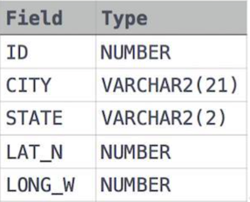

## SQL Assignment1


Q1.  Query all columns for all American cities in the CITY table with populations larger than 100000. The CountryCode for America is USA.
The CITY table is described as follows:


??? note "Answer"

    ### Creating the CITY Table

    ```sql
    CREATE TABLE CITY
    (
        ID INT,
        NAME VARCHAR(17),
        COUNTRYCODE VARCHAR(3),
        DISTRICT VARCHAR(20),
        POPULATION INT
    );
    ```


    This SQL command creates a table named CITY with columns ID (integer), NAME (varchar with a maximum length of 17 characters), COUNTRYCODE (varchar with a maximum length of 3 characters), DISTRICT (varchar with a maximum length of 20 characters), and POPULATION (integer).

    ### Describing the CITY Table

    ```sql
    DESCRIBE CITY;
    ```

    This command is used to display information about the structure of the CITY table, including the column names, data types, and any constraints.

    ### Inserting Data into the CITY Table

    ```sql
    INSERT INTO CITY VALUES
    (6, 'Rotterdam', 'NLD', 'Zuid-Holland', 593321),
    (3878, 'Scottsdale', 'USA', 'Arizona', 202705),
    -- (and additional rows)
    ;
    ```

    These commands insert data into the CITY table, providing values for the ID, NAME, COUNTRYCODE, DISTRICT, and POPULATION columns for each row.

    ### Selecting All Rows from the CITY Table

    ```sql
    SELECT * FROM CITY;
    ```

    This command retrieves all rows from the CITY table, displaying the values in all columns for each row.

    ### Filtering Rows Based on Conditions

    ```sql
    SELECT ID, NAME, COUNTRYCODE, DISTRICT, POPULATION
    FROM CITY
    WHERE COUNTRYCODE = 'USA' AND POPULATION > 100000;
    ```

    This query selects specific columns from the CITY table for rows where the COUNTRYCODE is 'USA' and the POPULATION is greater than 100,000.

    ### Alternative Query with Asterisk

    ```sql
    SELECT * FROM CITY WHERE COUNTRYCODE = 'USA' AND POPULATION > 100000;
    ```

    This is an equivalent query to the previous one, but it selects all columns using the asterisk (*) wildcard.

Q2.Query the NAME field for all American cities in the CITY table with populations larger than 120000. The CountryCode for America is USA.
The CITY table is described as follows:

??? note "Answer"

    SELECT NAME FROM CITY WHERE COUNTRYCODE = 'USA' AND POPULATION >
    120000;
Q3. Query all columns (attributes) for every row in the CITY table. The CITY table is described as follows:
??? note "Answer"
    select * from CITY;


Q4. Query all columns for a city in CITY with the ID 1661.
??? note "Answer"
    select * from CITY where ID = 1661;
Q5. Query all attributes of every Japanese city in the CITY table. The COUNTRYCODE for Japan is JPN.
??? note "Answer"
    SELECT * FROM CITY WHERE COUNTRYCODE = 'JPN';
Q6. Query the names of all the Japanese cities in the CITY table. The COUNTRYCODE for Japan is JPN.
??? note "Answer"
    SELECT NAME FROM CITY WHERE COUNTRYCODE = 'JPN';
Q7. Query a list of CITY and STATE from the STATION table. The STATION table is described as follows:




where LAT_N is the northern latitude and LONG_W is the western longitude.
??? note "Answer"
    Certainly! Here's an explanation of the provided SQL commands in Markdown format:

    ### Creating the STATION Table
    
    ```sql
    CREATE TABLE IF NOT EXISTS STATION
    (
         ID INT,
         CITY VARCHAR(21),
         STATE VARCHAR(2),
         LAT_N INT,
         LONG_W INT
    );
    ```
    
    This SQL command creates a table named STATION with columns ID (integer), CITY (varchar with a maximum length of 21 characters), STATE (varchar with a maximum length of 2 characters), LAT_N (integer), and LONG_W (integer). The "IF NOT EXISTS" clause ensures that the table is created only if it does not already exist.
    
    ### Describing the STATION Table
    
    ```sql
    DESCRIBE STATION;
    ```
    
    This command is used to display information about the structure of the STATION table, including the column names, data types, and any constraints.
    
    ### Inserting Data into the STATION Table
    
    ```sql
    -- (Multiple INSERT statements with data)
    INSERT INTO STATION VALUES
    (794, 'Kissee Mills', 'MO', 139, 73),
    (824, 'Loma Mar', 'CA', 48, 130),
    -- (and additional rows)
    ;
    ```
    
    These commands insert data into the STATION table, providing values for the ID, CITY, STATE, LAT_N, and LONG_W columns for each row.
    
    ### Selecting All Rows from the STATION Table
    
    ```sql
    SELECT * FROM STATION;
    ```
    
    This command retrieves all rows from the STATION table, displaying the values in all columns for each row.
    
    ### Selecting Specific Columns from the STATION Table
    
    ```sql
    SELECT CITY, STATE FROM STATION;
    ```
    
    This query selects specific columns (CITY and STATE) from the STATION table for all rows. It retrieves only the specified columns, providing a focused view of the data.

Q8. Query a list of CITY names from STATION for cities that have an even ID number. Print the results in any order, but exclude duplicates from the answer.

??? note "Answer"

    ### Selecting Distinct City Names from STATION Table
    
    ```sql
    SELECT DISTINCT(CITY) AS City_Name
    FROM STATION
    WHERE ID % 2 = 0
    ORDER BY CITY ASC;
    ```
    
    This SQL query performs the following operations:
    
    1. **SELECT DISTINCT(CITY) AS City_Name**: It selects unique city names from the STATION table. The use of DISTINCT ensures that duplicate city names are excluded. The `AS City_Name` alias is used to rename the result column to "City_Name."
    
       2. **FROM STATION**: Specifies the source table as STATION from which to retrieve the data.
    
       3. **WHERE ID % 2 = 0**: Filters the rows based on the condition that the ID column is even (divisible by 2). This means only rows with even ID values are included in the result set.
    
       4. **ORDER BY CITY ASC**: Orders the result set in ascending order based on the CITY column. The `ASC` keyword is optional, as sorting is ascending by default.
    
    ### Explanation:
    
    - **SELECT DISTINCT(CITY) AS City_Name**: This part of the query is responsible for selecting unique city names from the STATION table.
    
      - **FROM STATION**: Specifies the table from which the data is being retrieved, which is the STATION table in this case.
    
      - **WHERE ID % 2 = 0**: The WHERE clause filters the rows based on the condition that the ID column is even, ensuring that only rows with even ID values are considered.
    
      - **ORDER BY CITY ASC**: Orders the result set in ascending order based on the CITY column. The result will be a list of distinct city names with even ID values, sorted alphabetically.
Q9. Find the difference between the total number of CITY entries in the table and the number of distinct CITY entries in the table.
    where LAT_N is the northern latitude and LONG_W is the western longitude.
    For example, if there are three records in the table with CITY values 'New York', 'New York', 'Bengalaru', there are 2 different city names: 'New York' and 'Bengalaru'. The query returns , because total number of records - number of unique city names = 3-2 =1

??? note "Answer"
    
    ```markdown
    ## Explanation of SQL Query
    
    ### Objective
    The SQL query aims to retrieve information about the `CITY` column in the `STATION` table, including the total number of records, the number of unique city names, and the difference between the total count and the count of distinct city names.
    
    ### SQL Query
    ```sql
    SELECT 
        COUNT(CITY) AS TOTAL_NUMBER_OF_RECORDS,
        COUNT(DISTINCT(CITY)) AS NUMBER_OF_UNIQUE_CITY_NAMES,
        (COUNT(CITY) - COUNT(DISTINCT(CITY))) AS DIFFERENCE_CITY_COUNT  
    FROM 
        STATION;
    ```
    
    ### Explanation
    
    1. **`COUNT(CITY) AS TOTAL_NUMBER_OF_RECORDS`**: 
       - This part of the query calculates the total number of records in the `STATION` table by counting the occurrences of values in the `CITY` column.
       - The result is aliased as `TOTAL_NUMBER_OF_RECORDS` for better readability.
    
       2. **`COUNT(DISTINCT(CITY)) AS NUMBER_OF_UNIQUE_CITY_NAMES`**: 
          - This part of the query calculates the count of distinct (unique) values in the `CITY` column.
          - It provides the number of unique city names in the `STATION` table.
          - The result is aliased as `NUMBER_OF_UNIQUE_CITY_NAMES`.
    
       3. **`(COUNT(CITY) - COUNT(DISTINCT(CITY))) AS DIFFERENCE_CITY_COUNT`**: 
          - This part of the query calculates the difference between the total count of city names and the count of distinct city names.
          - It gives the count of non-unique (duplicate) city names in the `STATION` table.
          - The result is aliased as `DIFFERENCE_CITY_COUNT`.
    
    ### Result
    The final result of the query will provide a single row with three columns:
    - `TOTAL_NUMBER_OF_RECORDS`: Total count of records in the `STATION` table.
      - `NUMBER_OF_UNIQUE_CITY_NAMES`: Count of unique city names in the `STATION` table.
      - `DIFFERENCE_CITY_COUNT`: The difference between the total count and the count of distinct city names, indicating the number of duplicate city names in the `STATION` table.
    ```
--Q10. Query the two cities in STATION with the shortest and longest
CITY names, as well as their respective lengths (i.e.: number of
characters in the name). If there is more than one smallest or largest
city, choose the one that comes first when ordered alphabetically.
--Sample Input
--For example, CITY has four entries: DEF, ABC, PQRS and WXY.
--Sample Output
--ABC 3
--PQRS 4
--Hint -
--When ordered alphabetically, the CITY names are listed as ABC, DEF,
PQRS, and WXY, with lengths and. The longest name is PQRS, but there
are options for shortest named city. Choose ABC, because it comes first
alphabetically.
--Note
--You can write two separate queries to get the desired output. It need
not be a single query.

??? note "Answer"   
    ```markdown
    ## Explanation of SQL Queries
    
    ### Query 1
    ```sql
    SELECT CITY, LENGTH(CITY) AS MIN_LENGTH_OF_CITY
    FROM STATION
    ORDER BY LENGTH(CITY) ASC
    LIMIT 1;
    ```
    
    #### Objective
    The first query aims to retrieve the city with the minimum length (number of characters) from the `CITY` column in the `STATION` table.
    
    #### Explanation
    1. **`SELECT CITY, LENGTH(CITY) AS MIN_LENGTH_OF_CITY`**:
       - The query selects the `CITY` column and calculates the length of each city name using `LENGTH(CITY)`.
       - The result is aliased as `MIN_LENGTH_OF_CITY` for better readability.
    
       2. **`FROM STATION`**:
          - Specifies that the data is to be retrieved from the `STATION` table.
    
       3. **`ORDER BY LENGTH(CITY) ASC`**:
          - Orders the result set in ascending order based on the length of the city names.
          - This ensures that the city with the minimum length comes first in the result set.
    
       4. **`LIMIT 1`**:
          - Limits the result set to only one row, effectively retrieving the city with the minimum length.
    
    ### Query 2
    ```sql
    SELECT CITY, LENGTH(CITY) AS MAX_LENGTH_OF_CITY
    FROM STATION
    ORDER BY LENGTH(CITY) DESC
    LIMIT 1;
    ```
    
    #### Objective
    The second query aims to retrieve the city with the maximum length (number of characters) from the `CITY` column in the `STATION` table.
    
    #### Explanation
    1. **`SELECT CITY, LENGTH(CITY) AS MAX_LENGTH_OF_CITY`**:
       - Similar to the first query, this selects the `CITY` column and calculates the length of each city name.
       - The result is aliased as `MAX_LENGTH_OF_CITY`.
    
       2. **`FROM STATION`**:
          - Specifies that the data is to be retrieved from the `STATION` table.
    
       3. **`ORDER BY LENGTH(CITY) DESC`**:
          - Orders the result set in descending order based on the length of the city names.
          - This ensures that the city with the maximum length comes first in the result set.
    
       4. **`LIMIT 1`**:
          - Limits the result set to only one row, effectively retrieving the city with the maximum length.
    
    ### Result
    The result of each query will be a single row containing the city name and its corresponding length. The first query provides the city with the minimum length, and the second query provides the city with the maximum length.
    ```
Q11. Query the list of CITY names starting with vowels (i.e., a, e,
i, o, or u) from STATION. Your result cannot contain duplicates.

??? note "Answer"   

    ```markdown
    
    
    ```sql
    SELECT DISTINCT CITY
    FROM STATION
    WHERE LOWER(CITY) LIKE 'a%'
       OR LOWER(CITY) LIKE 'e%'
       OR LOWER(CITY) LIKE 'i%'
       OR LOWER(CITY) LIKE 'o%'
       OR LOWER(CITY) LIKE 'u%'
    ORDER BY CITY;
    ```

    ### Objective
    The SQL query aims to retrieve distinct city names from the `CITY` column in the `STATION` table where the city name starts with a vowel (either 'a', 'e', 'i', 'o', or 'u'). The result is ordered alphabetically by city name.
    
    ### Explanation
    
    1. **`SELECT DISTINCT CITY`**:
       - This part of the query selects distinct city names from the `CITY` column.
    
       2. **`FROM STATION`**:
          - Specifies that the data is to be retrieved from the `STATION` table.
    
       3. **`WHERE LOWER(CITY) LIKE 'a%' OR LOWER(CITY) LIKE 'e%' OR LOWER(CITY) LIKE 'i%' OR LOWER(CITY) LIKE 'o%' OR LOWER(CITY) LIKE 'u%'`**:
          - The `WHERE` clause filters the results based on the condition that the lowercase version of the city name (`LOWER(CITY)`) should start with any of the vowels ('a', 'e', 'i', 'o', or 'u').
          - `LIKE 'a%'` checks for city names starting with 'a', and similarly for other vowels.
          - The `LOWER()` function is used to ensure case-insensitive comparison.
    
       4. **`ORDER BY CITY`**:
          - Orders the result set alphabetically by the city names.
    
    ### Result
    The result of the query will be a list of distinct city names from the `STATION` table where each city name starts with a vowel. The list is ordered alphabetically by city name.

Q12. Query the list of CITY names ending with vowels (a, e, i, o, u) from STATION. Your result cannot contain duplicates.
Certainly! Here's the explanation of the provided SQL query in Markdown format:
??? note "Answer"   
    ```markdown
    ## Explanation of SQL Query
    
    ```sql
    SELECT DISTINCT CITY
    FROM STATION
    WHERE LOWER(CITY) LIKE '%a'
       OR LOWER(CITY) LIKE '%e'
       OR LOWER(CITY) LIKE '%i'
       OR LOWER(CITY) LIKE '%o'
       OR LOWER(CITY) LIKE '%u'
    ORDER BY CITY;
    ```
    
    ### Objective
    The SQL query aims to retrieve distinct city names from the `CITY` column in the `STATION` table where the city name ends with a vowel ('a', 'e', 'i', 'o', or 'u'). The result is ordered alphabetically by city name.
    
    ### Explanation
    
    1. **`SELECT DISTINCT CITY`**:
       - This part of the query selects distinct city names from the `CITY` column.
    
       2. **`FROM STATION`**:
          - Specifies that the data is to be retrieved from the `STATION` table.
    
       3. **`WHERE LOWER(CITY) LIKE '%a' OR LOWER(CITY) LIKE '%e' OR LOWER(CITY) LIKE '%i' OR LOWER(CITY) LIKE '%o' OR LOWER(CITY) LIKE '%u'`**:
          - The `WHERE` clause filters the results based on the condition that the lowercase version of the city name (`LOWER(CITY)`) should end with any of the vowels ('a', 'e', 'i', 'o', or 'u').
          - `LIKE '%a'` checks for city names ending with 'a', and similarly for other vowels.
          - The `%` symbol is a wildcard character that represents zero or more characters.
    
       4. **`ORDER BY CITY`**:
          - Orders the result set alphabetically by the city names.
    
    ### Result
    The result of the query will be a list of distinct city names from the `STATION` table where each city name ends with a vowel. The list is ordered alphabetically by city name.
    
    This query is useful for obtaining a subset of city names that meet the specified criteria, providing a result set containing only distinct city names that end with a vowel.
    
        ```markdown
        ## Explanation of SQL Query
        
        ```sql
        SELECT DISTINCT CITY
        FROM STATION
        WHERE LOWER(CITY) LIKE '%a'
           OR LOWER(CITY) LIKE '%e'
           OR LOWER(CITY) LIKE '%i'
           OR LOWER(CITY) LIKE '%o'
           OR LOWER(CITY) LIKE '%u'
        ORDER BY CITY;
        ```
        
        ### Objective
        The SQL query aims to retrieve distinct city names from the `CITY` column in the `STATION` table where the city name ends with a vowel ('a', 'e', 'i', 'o', or 'u'). The result is ordered alphabetically by city name.
        
        ### Explanation
        
        1. **`SELECT DISTINCT CITY`**:
           - This part of the query selects distinct city names from the `CITY` column.
        
           2. **`FROM STATION`**:
              - Specifies that the data is to be retrieved from the `STATION` table.
        
           3. **`WHERE LOWER(CITY) LIKE '%a' OR LOWER(CITY) LIKE '%e' OR LOWER(CITY) LIKE '%i' OR LOWER(CITY) LIKE '%o' OR LOWER(CITY) LIKE '%u'`**:
              - The `WHERE` clause filters the results based on the condition that the lowercase version of the city name (`LOWER(CITY)`) should end with any of the vowels ('a', 'e', 'i', 'o', or 'u').
              - `LIKE '%a'` checks for city names ending with 'a', and similarly for other vowels.
              - The `%` symbol is a wildcard character that represents zero or more characters.
        
           4. **`ORDER BY CITY`**:
              - Orders the result set alphabetically by the city names.
        
        ### Result
        The result of the query will be a list of distinct city names from the `STATION` table where each city name ends with a vowel. The list is ordered alphabetically by city name.
        

Q13. Query the list of CITY names from STATION that do not start with
vowels. Your result cannot contain duplicates.

??? note "Answer" 

    
    ```markdown
    
    
    ```sql
    SELECT DISTINCT CITY
    FROM STATION
    WHERE LOWER(CITY) NOT LIKE 'a%'
       AND LOWER(CITY) NOT LIKE 'e%'
       AND LOWER(CITY) NOT LIKE 'i%'
       AND LOWER(CITY) NOT LIKE 'o%'
       AND LOWER(CITY) NOT LIKE 'u%'
    ORDER BY CITY;
    ```
    
    ### Objective
    The SQL query aims to retrieve distinct city names from the `CITY` column in the `STATION` table where the city name does not start with any vowel ('a', 'e', 'i', 'o', or 'u'). The result is ordered alphabetically by city name.
    
    ### Explanation
    
    1. **`SELECT DISTINCT CITY`**:
       - This part of the query selects distinct city names from the `CITY` column.
    
       2. **`FROM STATION`**:
          - Specifies that the data is to be retrieved from the `STATION` table.
    
       3. **`WHERE LOWER(CITY) NOT LIKE 'a%' AND LOWER(CITY) NOT LIKE 'e%' AND LOWER(CITY) NOT LIKE 'i%' AND LOWER(CITY) NOT LIKE 'o%' AND LOWER(CITY) NOT LIKE 'u%'`**:
          - The `WHERE` clause filters the results based on the condition that the lowercase version of the city name (`LOWER(CITY)`) should not start with any of the vowels ('a', 'e', 'i', 'o', or 'u').
          - `NOT LIKE 'a%'` ensures that city names do not start with 'a', and similarly for other vowels.
    
       4. **`ORDER BY CITY`**:
          - Orders the result set alphabetically by the city names.
    
    ### Result
    The result of the query will be a list of distinct city names from the `STATION` table where each city name does not start with any vowel. The list is ordered alphabetically by city name.
    
    This query is useful for obtaining a subset of city names that meet the specified criteria, providing a result set containing only distinct city names that do not start with a vowel.

Q14.Query the list of CITY names from STATION that do not end with
vowels. Your result cannot contain duplicates.

??? note "Answer" 

        ```markdown
        ## Explanation of SQL Query
        
        ```sql
        SELECT DISTINCT CITY
        FROM STATION
        WHERE LOWER(CITY) NOT LIKE '%a'
           AND LOWER(CITY) NOT LIKE '%e'
           AND LOWER(CITY) NOT LIKE '%i'
           AND LOWER(CITY) NOT LIKE '%o'
           AND LOWER(CITY) NOT LIKE '%u'
        ORDER BY CITY;
        ```

    ### Objective
    The SQL query aims to retrieve distinct city names from the `CITY` column in the `STATION` table where the city name does not contain any vowel ('a', 'e', 'i', 'o', or 'u') in any position. The result is ordered alphabetically by city name.
    
    ### Explanation
    
    1. **`SELECT DISTINCT CITY`**:
       - This part of the query selects distinct city names from the `CITY` column.
    
       2. **`FROM STATION`**:
          - Specifies that the data is to be retrieved from the `STATION` table.
    
       3. **`WHERE LOWER(CITY) NOT LIKE '%a' AND LOWER(CITY) NOT LIKE '%e' AND LOWER(CITY) NOT LIKE '%i' AND LOWER(CITY) NOT LIKE '%o' AND LOWER(CITY) NOT LIKE '%u'`**:
          - The `WHERE` clause filters the results based on the condition that the lowercase version of the city name (`LOWER(CITY)`) should not contain any of the vowels ('a', 'e', 'i', 'o', or 'u') in any position.
          - `NOT LIKE '%a'` ensures that city names do not contain 'a' in any position, and similarly for other vowels.
    
       4. **`ORDER BY CITY`**:
          - Orders the result set alphabetically by the city names.
    
    ### Result
    The result of the query will be a list of distinct city names from the `STATION` table where each city name does not contain any vowel in any position. The list is ordered alphabetically by city name.
    
    This query is useful for obtaining a subset of city names that meet the specified criteria, providing a result set containing only distinct city names that do not contain any vowel.

Q15. Query the list of CITY names from STATION that either do not
start with vowels or do not end with vowels. Your result cannot contain
duplicates.

??? note "Answer"
        ```markdown
        ## Explanation of SQL Query
        
        ```sql
        SELECT DISTINCT CITY
        FROM STATION
        WHERE CITY NOT REGEXP '^[aeiou]' OR CITY NOT REGEXP '[aeiou]$';
        ```
        
        ### Objective
        The SQL query aims to retrieve distinct city names from the `CITY` column in the `STATION` table where the city name does not start with a vowel ('a', 'e', 'i', 'o', or 'u') or end with a vowel. The result set only includes city names that satisfy either of these conditions.
        
        ### Explanation
        
        1. **`SELECT DISTINCT CITY`**:
           - This part of the query selects distinct city names from the `CITY` column.
        
           2. **`FROM STATION`**:
              - Specifies that the data is to be retrieved from the `STATION` table.
        
           3. **`WHERE CITY NOT REGEXP '^[aeiou]' OR CITY NOT REGEXP '[aeiou]$'`**:
              - The `WHERE` clause filters the results based on the condition that the city name should not match the regular expression patterns.
              - `'^[aeiou]'` checks if the city name does not start with a vowel.
              - `'[aeiou]$'` checks if the city name does not end with a vowel.
              - The `OR` operator allows the inclusion of city names that satisfy either of these conditions.
        
        ### Result
        The result of the query will be a list of distinct city names from the `STATION` table where each city name does not start with a vowel or does not end with a vowel. This provides a subset of city names that meet the specified criteria.
        
        This query is useful for obtaining a result set containing only distinct city names that do not start or end with a vowel.


    
        
        