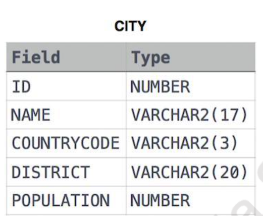
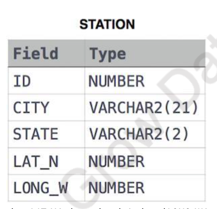

# SQL Query Challenges

## City-Dataset Questions


1. **Query all columns for all American cities in the CITY table with populations larger than 100,000.** The CountryCode for America is USA.
2. **Query the NAME field for all American cities in the CITY table with populations larger than 120,000.** The CountryCode for America is USA.
3. **Query all columns (attributes) for every row in the CITY table.**
4. **Query all columns for a city in CITY with the ID 1661.**
5. **Query all attributes of every Japanese city in the CITY table.** The COUNTRYCODE for Japan is JPN.
6. **Query the names of all the Japanese cities in the CITY table.** The COUNTRYCODE for Japan is JPN.



## Station-Table Questions
7. **Query a list of CITY and STATE from the STATION table.**
8. **Query a list of CITY names from STATION for cities that have an even ID number.** Print the results in any order, but exclude duplicates from the answer.
9. **Find the difference between the total number of CITY entries in the table and the number of distinct CITY entries in the table.**
10. **Query the two cities in STATION with the shortest and longest CITY names, as well as their respective lengths.** If there is more than one smallest or largest city, choose the one that comes first when ordered alphabetically.
11. **Query the list of CITY names starting with vowels (i.e., a, e, i, o, or u) from STATION.** Your result cannot contain duplicates.
12. **Query the list of CITY names ending with vowels (a, e, i, o, u) from STATION.** Your result cannot contain duplicates.
13. **Query the list of CITY names from STATION that do not start with vowels.** Your result cannot contain duplicates.
14. **Query the list of CITY names from STATION that do not end with vowels.** Your result cannot contain duplicates.
15. **Query the list of CITY names from STATION that either do not start with vowels or do not end with vowels.** Your result cannot contain duplicates.
16. **Query the list of CITY names from STATION that do not start with vowels and do not end with vowels.** Your result cannot contain duplicates.

## Complex Query Challenges
17. **Write an SQL query that reports the products that were only sold in the first quarter of 2019.**
18. **Write an SQL query to find all the authors that viewed at least one of their own articles.**
19. **Write an SQL query to find the percentage of immediate orders in the table, rounded to 2 decimal places.**
20. **Write an SQL query to find the ctr of each Ad.** Round ctr to two decimal points.
21. **Write an SQL query to find the team size of each of the employees.**
22. **Write an SQL query to find the type of weather in each country for November 2019.**
23. **Write an SQL query to find the average selling price for each product.** average_price should be rounded to 2 decimal places.
24. **Write an SQL query to report the first login date for each player.**
25. **Write an SQL query to report the device that is first logged in for each player.**
26. **Write an SQL query to get the names of products that have at least 100 units ordered in February 2020 and their amount.**
27. **Write an SQL query to find the users who have valid emails.**
28. **Write an SQL query to report the customer_id and customer_name of customers who have spent at least $100 in each month of June and July 2020.**
29. **Write an SQL query to report the distinct titles of the kid-friendly movies streamed in June 2020.**
30. **Write an SQL query to find the npv of each query of the Queries table.**
31. **Write an SQL query to find the npv of each query of the Queries table.** (Duplicate of Q30)
32. **Write an SQL query to show the unique ID of each user, If a user does not have a unique ID replace just show null.**
33. **Write an SQL query to report the distance travelled by each user.**
34. **Write an SQL query to get the names of products that have at least 100 units ordered in February 2020 and their amount.** (Duplicate of Q26)
35. **Write an SQL query to:**
    - **Find the name of the user who has rated the greatest number of movies.**
    - **Find the movie name with the highest average rating in February 2020.**
36. **Write an SQL query to report the distance travelled by each user.** (Duplicate of Q33)
37. **Write an SQL query to show the unique ID of each user, If a user does not have a unique ID replace just show null.** (Duplicate of Q32)
38. **Write an SQL query to find the id and the name of all students who are enrolled in departments that no longer exist.**
39. **Write an SQL query to report the number of calls and the total call duration between each pair of distinct persons (person1, person2) where person1 < person2.**
40. **Write an SQL query to find the average selling price for each product.** average_price should be rounded to 2 decimal places. (Duplicate of Q23)
41. **Write an SQL query to report the number of cubic feet of volume the inventory occupies in each warehouse.**
42. **Write an SQL query to report the difference between the number of apples and oranges sold each day.**
43. **Write an SQL query to report the fraction of players that logged in again on the day after the day they first logged in, rounded to 2 decimal places.**
44. **Write an SQL query to report the managers with at least five direct reports.**
45. **Write an SQL query to report the respective department name and number of students majoring in each department for all departments in the Department table.**
46. **Write an SQL query to report the customer ids from the Customer table that bought all the products in the Product table.**
47. **Write an SQL query that reports the most experienced employees in each project.**
48. **Write an SQL query that reports the books that have sold less than 10 copies in the last year, excluding books that have been available for less than one month from today.**
49. **Write a SQL query to find the highest grade with its corresponding course for each student.**
50. **Write an SQL query to find the winner in each group.**

## Explanation of SQL Commands

### Q1. Query All Columns for All American Cities with Populations Larger Than 100,000

```sql
SELECT ID, NAME, COUNTRYCODE, DISTRICT, POPULATION
FROM CITY
WHERE COUNTRYCODE = 'USA' AND POPULATION > 100000;
```

#### Objective
To select all details (ID, Name, CountryCode, District, Population) of American cities (where CountryCode is 'USA') from the `CITY` table that have a population greater than 100,000.

#### Explanation

1. **`SELECT ID, NAME, COUNTRYCODE, DISTRICT, POPULATION`**:
   - This command selects all columns of interest from the `CITY` table, providing a comprehensive view of the data for cities.

2. **`FROM CITY`**:
   - Indicates the query is to retrieve data from the `CITY` table.

3. **`WHERE COUNTRYCODE = 'USA' AND POPULATION > 100000`**:
   - The `WHERE` clause filters cities within the United States (`COUNTRYCODE = 'USA'`) that have a population exceeding 100,000. This ensures only relevant records matching both conditions are returned.

### Result
The result set includes all columns of cities in the `CITY` table that are located in the USA and have populations over 100,000, giving detailed demographic insights into larger American cities.

---

### Q2. Query the NAME Field for All American Cities with Populations Larger Than 120,000

```sql
SELECT NAME FROM CITY WHERE COUNTRYCODE = 'USA' AND POPULATION > 120000;
```

#### Objective
To retrieve the names of cities in the USA with a population greater than 120,000 from the `CITY` table.

#### Explanation

1. **`SELECT NAME`**:
   - Focuses on retrieving only the `NAME` column, which contains the names of the cities.

2. **`FROM CITY`**:
   - Specifies the data source as the `CITY` table.

3. **`WHERE COUNTRYCODE = 'USA' AND POPULATION > 120000`**:
   - Filters for cities within the United States having a population above 120,000. It ensures that only cities meeting both criteria are included in the output.

### Result
Produces a list of names of American cities from the `CITY` table with populations exceeding 120,000, highlighting more densely populated areas within the country.

---

### General Structure for Queries Q3 to Q5

Following the format requested, let's apply a similar explanation structure for the remaining queries:

### Q3. Query All Columns (Attributes) for Every Row in the CITY Table

#### Objective
To select and display all data from every column of every record in the `CITY` table.

```sql
SELECT * FROM CITY;
```

#### Explanation

1. **`SELECT *`**:
   - The asterisk (*) is used to select all columns available in the `CITY` table without specifying each column name.

2. **`FROM CITY`**:
   - Indicates that the query will fetch data from all rows present in the `CITY` table.

### Result
The output will include the complete dataset contained in the `CITY` table, providing an exhaustive view of all cities' data without any filtration.

---

### Q4. Query All Columns for a City in CITY with the ID 1661

#### Objective
To retrieve full details of the city with the specific ID of 1661 from the `CITY` table.

```sql
SELECT * FROM CITY WHERE ID = 1661;
```

#### Explanation

1. **`SELECT *`**:
   - Selects all columns from the specified row(s) in the `CITY` table.

2. **`WHERE ID = 1661`**:
   - Filters the query to return only the city that has an ID value of 1661, ensuring targeted retrieval of data.

### Result
Returns all information about the city with ID 1661 from the `CITY` table, if such a city exists in the dataset.

---

### Q5. Query All Attributes of Every Japanese City in the CITY Table

#### Objective
To fetch complete records for all cities in Japan (where CountryCode is 'JPN') from the `CITY` table.

```sql
SELECT * FROM CITY WHERE COUNTRYCODE = 'JPN';
```

#### Explanation

1. **`SELECT *`**:
   - Aims to retrieve all columns for cities that meet the following condition.

2. **`WHERE COUNTRYCODE = 'JPN'`**:
   - The query is specifically focused on cities within Japan, filtering the results to include only those entries where the CountryCode matches 'JPN'.

### Result
Generates a dataset of all Japanese cities listed in the `CITY` table, providing detailed

### Explanation of SQL Query: Selecting Japanese Cities from the CITY Table

---

#### Q6 

```sql
SELECT NAME FROM CITY WHERE COUNTRYCODE = 'JPN';
```

#### Objective

The purpose of this SQL query is to retrieve the names of all cities located in Japan from a database table named `CITY`.

#### Explanation

- **`SELECT NAME`**:
  - This part of the query specifies that only the `NAME` column, which contains the names of the cities, is to be retrieved from the table. It focuses the output solely on the city names, excluding any other information about the cities that might be stored in the table.

- **`FROM CITY`**:
  - Indicates that the data will be fetched from the `CITY` table. This table is presumed to contain information about various cities, including their names (`NAME`), country codes (`COUNTRYCODE`), and possibly other geographical details like districts or populations.

- **`WHERE COUNTRYCODE = 'JPN'`**:
  - This condition filters the results of the query to include only those rows where the `COUNTRYCODE` column matches 'JPN'. The country code 'JPN' is commonly used as an abbreviation for Japan, meaning that this condition restricts the query results to cities within Japan.

#### Result

This query produces a list of city names from the `CITY` table that are located in Japan, based on the 'JPN' country code. The result is useful for identifying Japanese cities within a global or multi-national database, providing a focused view on a specific geographical region without extraneous data.

### Explanation of the SQL Query for Q7

```sql
SELECT CITY, STATE FROM STATION;
```

#### Objective
To retrieve a list of cities along with their corresponding states from the `STATION` table.

#### Explanation

- **`SELECT CITY, STATE`**:
  - This part of the query specifies the columns to be retrieved from the database. In this case, it's asking for the names of cities (`CITY`) and the states (`STATE`) they are located in.

- **`FROM STATION`**:
  - Indicates the source of the data, which is the `STATION` table. This table contains various information about stations, including their city and state locations.

#### Creating and Preparing the STATION Table

- **`CREATE TABLE IF NOT EXISTS STATION`**:
  - Before querying, a table named STATION is created with columns for ID, CITY, STATE, LAT_N (latitude), and LONG_W (longitude). The "IF NOT EXISTS" clause ensures the table is only created if it does not already exist in the database, preventing errors.

- **`DESCRIBE STATION;`**:
  - This command is used to display the structure of the STATION table, showing details about each column such as type and constraints. This step is more about understanding the table schema than a direct part of querying for city and state data.

- **`INSERT INTO STATION VALUES(...);`**:
  - Multiple insert statements are used to populate the STATION table with data. Each `INSERT INTO` command adds a new row to the table, specifying values for all columns defined in the table structure.

#### Result
The query produces a list of cities and their states from the data available in the STATION table. This can be useful for various purposes, such as analyzing weather patterns by location, planning logistics, or even just for informational purposes related to geography.

### Explanation of the SQL Query for Q7

```sql
SELECT CITY, STATE FROM STATION;
```

#### Objective
To retrieve a list of cities along with their corresponding states from the `STATION` table.

#### Explanation

- **`SELECT CITY, STATE`**:
  - This part of the query specifies the columns to be retrieved from the database. In this case, it's asking for the names of cities (`CITY`) and the states (`STATE`) they are located in.

- **`FROM STATION`**:
  - Indicates the source of the data, which is the `STATION` table. This table contains various information about stations, including their city and state locations.

#### Creating and Preparing the STATION Table

- **`CREATE TABLE IF NOT EXISTS STATION`**:
  - Before querying, a table named STATION is created with columns for ID, CITY, STATE, LAT_N (latitude), and LONG_W (longitude). The "IF NOT EXISTS" clause ensures the table is only created if it does not already exist in the database, preventing errors.

- **`DESCRIBE STATION;`**:
  - This command is used to display the structure of the STATION table, showing details about each column such as type and constraints. This step is more about understanding the table schema than a direct part of querying for city and state data.

- **`INSERT INTO STATION VALUES(...);`**:
  - Multiple insert statements are used to populate the STATION table with data. Each `INSERT INTO` command adds a new row to the table, specifying values for all columns defined in the table structure.

#### Result
The query produces a list of cities and their states from the data available in the STATION table. This can be useful for various purposes, such as analyzing weather patterns by location, planning logistics, or even just for informational purposes related to geography.

### Explanation of the SQL Query for Q8

```sql
SELECT DISTINCT(CITY) AS City_Name FROM STATION WHERE ID % 2 = 0 ORDER BY CITY ASC;
```

#### Objective
To retrieve a unique list of cities from the `STATION` table that have an even station ID number, ordered alphabetically.

#### Explanation

- **`SELECT DISTINCT(CITY) AS City_Name`**:
  - This command selects unique city names from the `CITY` column to ensure there are no duplicate entries in the output. It renames the output column to `City_Name` for clarity.

- **`FROM STATION`**:
  - Specifies the source of the data, which is the `STATION` table. This table contains records of various stations, including their city names and IDs.

- **`WHERE ID % 2 = 0`**:
  - The `WHERE` clause filters the records to include only those with an even `ID`. The modulus operator (`%`) is used to divide the ID by 2 and select records with a remainder of 0, indicating even numbers.

- **`ORDER BY CITY ASC`**:
  - Ensures the resulting list of city names is sorted in ascending alphabetical order.

#### Result
This query generates a list of distinct city names where the station ID is even, with the city names presented in alphabetical order. It is useful for identifying specific geographic locations that meet a numerical condition on their identifiers, potentially aiding in organized data analysis or reporting.


### Explanation of the SQL Query

```sql
SELECT COUNT(CITY) AS TOTAL_NUMBER_OF_RECORDS,
       COUNT(DISTINCT(CITY)) AS NUMBER_OF_UNIQUE_CITY_NAMES,
       (COUNT(CITY) - COUNT(DISTINCT(CITY))) AS DIFFERENCE_CITY_COUNT
FROM STATION;
```

#### Objective
To calculate the total number of city entries, the number of unique city names, and the difference between these two counts in the `STATION` table.

#### Explanation

- **`SELECT COUNT(CITY) AS TOTAL_NUMBER_OF_RECORDS`**:
  - This part of the query counts the total number of `CITY` entries in the `STATION` table, including duplicates. It labels this count as `TOTAL_NUMBER_OF_RECORDS`.

- **`COUNT(DISTINCT(CITY)) AS NUMBER_OF_UNIQUE_CITY_NAMES`**:
  - Counts the unique city names in the `STATION` table, ignoring duplicates. This count is labeled as `NUMBER_OF_UNIQUE_CITY_NAMES`.

- **`(COUNT(CITY) - COUNT(DISTINCT(CITY))) AS DIFFERENCE_CITY_COUNT`**:
  - Calculates the difference between the total number of city entries and the number of unique city names. This represents how many duplicate city entries exist in the table. The result is labeled as `DIFFERENCE_CITY_COUNT`.

- **`FROM STATION`**:
  - Specifies that the data is to be retrieved from the `STATION` table, which contains information about various stations, including their city names.

#### Result
This query provides three key pieces of information:
- The total number of city entries in the `STATION` table, which may include duplicates.
- The total number of unique city names, eliminating any duplicates.
- The difference between these two counts, indicating the presence and extent of duplicate city entries.

This data can be useful for understanding the diversity of station locations and assessing data quality, particularly the redundancy of city names within the dataset.

### Explanation of the SQL Queries for Finding Cities with Shortest and Longest Names

These SQL queries aim to identify the city with the shortest name and the city with the longest name in the `STATION` table. Each query also returns the length of the city name.

#### Query for the Shortest City Name

```sql
SELECT CITY, LENGTH(CITY) AS MIN_LENGTH_OF_CITY FROM STATION ORDER BY LENGTH(CITY) ASC LIMIT 1;
```

- **`SELECT CITY, LENGTH(CITY) AS MIN_LENGTH_OF_CITY`**: This part of the query selects two pieces of information for each city: the city's name (`CITY`) and the length of the city's name (`LENGTH(CITY)`). The length of the city name is labeled as `MIN_LENGTH_OF_CITY`.

- **`FROM STATION`**: Specifies that the data should be retrieved from the `STATION` table.

- **`ORDER BY LENGTH(CITY) ASC`**: Orders the cities by the length of their names in ascending order (from shortest to longest).

- **`LIMIT 1`**: Limits the result set to the first record, which, due to the ordering, will be the city with the shortest name.

#### Query for the Longest City Name

```sql
SELECT CITY, LENGTH(CITY) AS MAX_LENGTH_OF_CITY FROM STATION ORDER BY LENGTH(CITY) DESC LIMIT 1;
```

- **`SELECT CITY, LENGTH(CITY) AS MAX_LENGTH_OF_CITY`**: Selects each city's name and the length of its name, labeling the length as `MAX_LENGTH_OF_CITY`.

- **`FROM STATION`**: Indicates the data source is the `STATION` table.

- **`ORDER BY LENGTH(CITY) DESC`**: Orders the cities by the length of their names in descending order (from longest to shortest).

- **`LIMIT 1`**: Restricts the output to the first record in the ordered list, which will be the city with the longest name because of the ordering criteria.

#### Results

- The first query identifies the city with the shortest name in the `STATION` table, along with the length of that name.
- The second query identifies the city with the longest name, along with the length of that name.

These queries are particularly useful for data analysis tasks that require understanding the variability in the length of city names within a dataset, such as preparing for data storage optimization or analyzing naming patterns.


### Explanation of the SQL Query

```sql
SELECT DISTINCT CITY FROM STATION
WHERE lcase(CITY) LIKE 'a%'
OR lcase(CITY) LIKE 'e%'
OR lcase(CITY) LIKE 'i%'
OR lcase(CITY) LIKE 'o%'
OR lcase(CITY) LIKE 'u%'
ORDER BY CITY;
```

#### Objective
To retrieve a list of unique city names from the `STATION` table that start with a vowel (a, e, i, o, u), disregarding case sensitivity.

#### Explanation

- **`SELECT DISTINCT CITY`**:
  - This part of the query selects unique city names from the `CITY` column to ensure no duplicates in the output.

- **`FROM STATION`**:
  - Indicates that the data is retrieved from the `STATION` table.

- **`WHERE lcase(CITY) LIKE 'a%' OR lcase(CITY) LIKE 'e%' OR lcase(CITY) LIKE 'i%' OR lcase(CITY) LIKE 'o%' OR lcase(CITY) LIKE 'u%'`**:
  - The `WHERE` clause filters the cities based on the starting letter. It uses `lcase` function to convert city names to lowercase, making the comparison case-insensitive.
  - `LIKE 'a%'` (and similarly for 'e', 'i', 'o', 'u') matches any city name starting with the specified vowel.

- **`ORDER BY CITY`**:
  - Orders the resulting list of city names in ascending alphabetical order.

#### Result
Produces a list of unique city names from the `STATION` table that begin with a vowel, sorted alphabetically. This query is useful for identifying geographical locations with names that start with vowels, possibly for categorization or analysis based on naming conventions.

### Explanation of the SQL Queries for Selecting Cities Starting with Vowels

These SQL queries aim to select distinct city names from the `STATION` table that start with a vowel (A, E, I, O, U), regardless of case sensitivity. Two approaches are demonstrated to achieve this goal.

---

#### Query 1: Using `SUBSTR` and `IN`

```sql
SELECT DISTINCT(CITY) AS DISTINCT_CITY_NAME FROM STATION
WHERE lower(SUBSTR(city,1,1)) in ('a','e','i','o','u');
```

##### Objective
To fetch distinct city names from the `STATION` table where the first letter is a vowel.

##### Explanation

- **`SELECT DISTINCT(CITY) AS DISTINCT_CITY_NAME`**: Selects unique city names, preventing duplicate entries. The result column is aliased as `DISTINCT_CITY_NAME` for clarity.
  
- **`WHERE lower(SUBSTR(city,1,1)) in ('a','e','i','o','u')`**: Filters cities based on their starting character.
  - `SUBSTR(city,1,1)` extracts the first character of the city name.
  - `lower()` converts this character to lowercase to ensure case-insensitive comparison.
  - `IN ('a','e','i','o','u')` checks if the extracted character is a vowel.

##### Result
Generates a list of unique city names starting with a vowel, showcasing a method to handle case-insensitive string comparison and character extraction.

---

#### Query 2: Using `LIKE` with Vowels

```sql
SELECT DISTINCT CITY FROM STATION
WHERE lcase(CITY) LIKE 'a%'
OR lcase(CITY) LIKE 'e%'
OR lcase(CITY) LIKE 'i%'
OR lcase(CITY) LIKE 'o%'
OR lcase(CITY) LIKE 'u%'
ORDER BY CITY;
```

##### Objective
Similarly, this aims to list unique city names that start with a vowel, applying pattern matching.

##### Explanation

- **`SELECT DISTINCT CITY`**: Retrieves unique city names from the `STATION` table.
  
- **`WHERE lcase(CITY) LIKE 'a%' OR lcase(CITY) LIKE 'e%' ...`**: The `WHERE` clause uses `lcase()` to convert city names to lowercase, then applies `LIKE` to filter names beginning with each vowel. This approach checks each vowel pattern individually.
  
- **`ORDER BY CITY`**: Orders the resulting city names in ascending alphabetical order.

##### Result
Provides a list of distinct city names starting with a vowel, sorted alphabetically. This method demonstrates the use of pattern matching (`LIKE`) combined with case conversion for case-insensitive comparisons.

---

Both queries effectively retrieve city names starting with vowels from a specified table, showcasing two different techniques: string manipulation with `SUBSTR` and pattern matching with `LIKE`.


### Explanation of the SQL Query for Selecting Cities Ending with Vowels

This SQL query aims to select distinct city names from the `STATION` table that end with a vowel (A, E, I, O, U), ensuring a case-insensitive search. It demonstrates how to utilize pattern matching with the SQL `LIKE` operator, combined with string functions to achieve the desired filtering.

---

#### SQL Query

```sql
SELECT DISTINCT CITY FROM STATION
WHERE lcase(CITY) LIKE '%a'
OR lcase(CITY) LIKE '%e'
OR lcase(CITY) LIKE '%i'
OR lcase(CITY) LIKE '%o'
OR lcase(CITY) LIKE '%u'
ORDER BY CITY;
```

##### Objective
To fetch distinct city names that end with a vowel, from the `STATION` table.

##### Explanation

- **`SELECT DISTINCT CITY`**: Retrieves unique city names from the `STATION` table to prevent duplicate entries in the result set.
  
- **`WHERE lcase(CITY) LIKE '%a' OR lcase(CITY) LIKE '%e' ...`**: The `WHERE` clause filters the city names based on their ending character:
  - `lcase(CITY)` converts the city names to lowercase to ensure case-insensitive comparison.
  - `LIKE '%a'` (and similar patterns for other vowels) checks if the city name ends with the specified vowel. The percent sign (`%`) acts as a wildcard that matches any sequence of characters, ensuring that the query looks for names ending with a vowel.
  
- **`ORDER BY CITY`**: Orders the resulting city names in ascending alphabetical order, ensuring that the output is sorted for easier readability.

##### Result
The query produces a list of unique city names that end with a vowel, sorted alphabetically. This outcome highlights cities within the database that comply with the specified vowel-ending criteria, showcasing effective use of pattern matching and case manipulation in SQL for text-based filtering.

---

This method efficiently retrieves city names adhering to a specific pattern (ending with vowels) and showcases SQL's flexibility in handling string patterns and case sensitivity through simple yet powerful clauses.

### Explanation of the SQL Query for Selecting Cities Not Starting with Vowels

This SQL query retrieves a list of unique city names from the `STATION` table, specifically focusing on those cities whose names do not start with a vowel (a, e, i, o, u), irrespective of case.

---

#### SQL Query

```sql
SELECT DISTINCT CITY FROM STATION
WHERE lcase(CITY) NOT LIKE 'a%'
AND lcase(CITY) NOT LIKE 'e%'
AND lcase(CITY) NOT LIKE 'i%'
AND lcase(CITY) NOT LIKE 'o%'
AND lcase(CITY) NOT LIKE 'u%'
ORDER BY CITY;
```

##### Objective
The aim is to extract distinct city names that begin with consonants, ensuring a case-insensitive comparison by using the `lcase` function to convert city names to lowercase.

##### Key Components

- **`SELECT DISTINCT CITY`**: Selects unique city names, ensuring no duplicates in the output. The `DISTINCT` keyword filters out duplicate entries for city names.

- **`WHERE lcase(CITY) NOT LIKE 'x%'`**: The `WHERE` clause filters the city names based on their starting character:
  - `lcase(CITY)`: Converts the city name to lowercase for case-insensitive comparison.
  - `NOT LIKE 'x%'`: Ensures that the selected city names do not start with a specified character (`x` here represents each vowel). The `%` wildcard matches any sequence of characters following the initial letter.

- **`AND`**: Combines multiple conditions, requiring that all conditions be met. It ensures that the city name does not start with any of the vowels, a, e, i, o, or u.

- **`ORDER BY CITY`**: Sorts the resulting list of city names in ascending alphabetical order, making the output easier to read and analyze.

##### Result
The query produces a sorted list of city names that do not begin with any vowel, filtered in a case-insensitive manner. This approach is useful for scenarios requiring a selection of city names based on specific initial character criteria, demonstrating SQL's capabilities for string manipulation and pattern matching to refine data retrieval.

### Explanation of the SQL Query for Selecting City Names Not Ending with Vowels

This SQL query is designed to retrieve a unique list of city names from the `STATION` table, focusing specifically on those cities whose names do not end with a vowel (a, e, i, o, u). The query ensures a case-insensitive comparison to cater to all variations in city name capitalizations.

---

#### SQL Query

```sql
SELECT DISTINCT CITY FROM STATION
WHERE lcase(CITY) NOT LIKE '%a'
AND lcase(CITY) NOT LIKE '%e'
AND lcase(CITY) NOT LIKE '%i'
AND lcase(CITY) NOT LIKE '%o'
AND lcase(CITY) NOT LIKE '%u'
ORDER BY CITY;
```

##### Objective

The goal is to filter out and list distinct city names that conclude with consonants rather than vowels, applying a case-insensitive search to accommodate all city name cases in the database.

##### Key Components

- **`SELECT DISTINCT CITY`**: This portion of the query is responsible for selecting unique city names from the `CITY` column in the `STATION` table. The `DISTINCT` keyword is crucial here as it ensures that each city name appears only once in the result set, eliminating any duplicates.

- **`WHERE lcase(CITY) NOT LIKE '%x'`**: The `WHERE` clause is utilized to apply multiple conditions that the city names must meet:
  - `lcase(CITY)`: Converts the city name to lowercase. This function is used to perform a case-insensitive comparison.
  - `NOT LIKE '%x'`: Specifies that the selected city names must not end with a vowel. The `%` symbol is a wildcard that matches any sequence of characters, and `x` represents each vowel. The combination of these conditions ensures that cities ending in vowels are excluded from the results.

- **`AND`**: This logical operator is used to chain all the conditions together. It ensures that the city name must not end with any of the specified vowels to be included in the result set.

- **`ORDER BY CITY`**: Orders the final list of city names in ascending alphabetical order. This sorting makes the output more organized and easier to analyze.

##### Result

The output is a neatly organized, alphabetically sorted list of distinct city names that do not end with any of the vowels (a, e, i, o, u), considering all possible case variations of city names. This specific filtering showcases the power of SQL for performing pattern matching and string manipulation to achieve precise data selection criteria.

### Explanation of the SQL Query for Selecting City Names Not Starting or Ending with Vowels

This SQL query retrieves a unique list of city names from the `STATION` table that either do not start with a vowel (a, e, i, o, u) or do not end with a vowel. The use of a regular expression (regexp) provides a powerful way to apply complex pattern-matching directly within the SQL query.

---

#### SQL Query

```sql
SELECT DISTINCT CITY FROM STATION WHERE CITY NOT REGEXP '^[aeiou]' OR CITY NOT REGEXP '[aeiou]$';
```

##### Objective

To filter and list distinct city names that either begin with a consonant or end with a consonant, excluding any city names that both start and end with a vowel.

##### Key Components

- **`SELECT DISTINCT CITY`**: Selects unique city names from the `CITY` column, ensuring no duplicates in the output.

- **`FROM STATION`**: Indicates the data source, the `STATION` table, from which city names are to be fetched.

- **`WHERE CITY NOT REGEXP '^[aeiou]' OR CITY NOT REGEXP '[aeiou]$'`**:
  - This condition uses the `NOT REGEXP` operator to filter city names against two regular expressions:
    - `'^[aeiou]'`: Matches city names that start with a vowel. The caret (`^`) symbol represents the start of the string. `NOT REGEXP` inverts the match, excluding these city names.
    - `'[aeiou]$'`: Matches city names that end with a vowel. The dollar sign (`$`) denotes the end of the string. Again, `NOT REGEXP` inverts the match to exclude such names.
  - The `OR` operator between these conditions ensures that city names are selected if they fail to match at least one of these patterns (i.e., either start or end with a consonant).

##### Result

The output will be an alphabetically unordered list of distinct city names from the `STATION` table that do not strictly adhere to vowel start and end conventions. This query effectively captures a broader range of city names by focusing on those that either start or end with consonants, showcasing the versatility of SQL in handling complex string pattern matching and logical conditions.

### Explanation of the SQL Query for Selecting City Names Neither Starting nor Ending with Vowels

This SQL query aims to fetch a unique list of city names from the `STATION` table, specifically focusing on those city names that neither start with a vowel (a, e, i, o, u) nor end with a vowel. This particular query leverages the power of regular expressions within SQL to succinctly apply pattern matching for both the beginning and end of city names.

---

#### SQL Query

```sql
SELECT DISTINCT CITY FROM STATION WHERE CITY NOT REGEXP '^[aeiou]' AND CITY NOT REGEXP '[aeiou]$';
```

##### Objective

The goal is to filter out and list distinct city names that start and end with consonants, excluding all city names that either start with a vowel or end with a vowel.

##### Key Components

- **`SELECT DISTINCT CITY`**: This clause selects unique (no duplicates) city names from the `CITY` column in the `STATION` table.

- **`FROM STATION`**: Specifies the `STATION` table as the data source for the query.

- **`WHERE CITY NOT REGEXP '^[aeiou]' AND CITY NOT REGEXP '[aeiou]$'`**:
  - The condition uses `NOT REGEXP` to exclude city names based on two criteria:
    - `'^[aeiou]'`: This pattern identifies city names that start with a vowel. The caret (`^`) symbolizes the start of the string. `NOT REGEXP` reverses the match to exclude cities starting with vowels.
    - `'[aeiou]$'`: This pattern pinpoints city names ending with a vowel. The dollar sign (`$`) signifies the end of the string. Using `NOT REGEXP` here excludes cities ending with vowels.
  - The `AND` logical operator ensures that both conditions must be met for a city name to be included in the results. Thus, only city names that neither start with a vowel nor end with a vowel are selected.

##### Result

The result of this query is a list of distinct city names from the `STATION` table that start and end with consonants, effectively filtering out any city names that don't match both criteria. This approach highlights the flexibility of SQL in handling precise string pattern exclusions and showcases how regular expressions can significantly enhance querying capabilities for specific pattern matching.

### Explanation of the SQL Query for Products Sold Only in the First Quarter of 2019

This SQL query is designed to identify and report products from the `Product` table that were exclusively sold in the first quarter of 2019, specifically between January 1st, 2019, and March 31st, 2019.

---

#### SQL Query Structure

```sql
SELECT product_id, product_name
FROM   Product
WHERE  product_id NOT IN (
    SELECT product_id
    FROM Sales
    WHERE sale_date < '2019-01-01' OR sale_date > '2019-03-31'
);
```

##### Objective

The main goal of this query is to filter out and list the products that were only sold during the first quarter (Q1) of 2019. This period is defined from January 1st to March 31st, inclusive.

##### Key Components

- **`SELECT product_id, product_name FROM Product`**: This part of the query selects the `product_id` and `product_name` columns from the `Product` table, aiming to retrieve the details of the relevant products.

- **`WHERE product_id NOT IN (...)`**: The `WHERE` clause is used to exclude certain products based on their `product_id`. The `NOT IN` operator is crucial here, as it filters out products that do not meet the specified criteria.

- **Subquery**:
  - **`SELECT product_id FROM Sales WHERE sale_date < '2019-01-01' OR sale_date > '2019-03-31'`**: The subquery selects `product_id` from the `Sales` table where the `sale_date` is either before January 1st, 2019, or after March 31st, 2019. This effectively identifies products sold outside the first quarter of 2019.
  - The purpose of this subquery is to create a list of product IDs that were sold either before or after the Q1 of 2019, thereby excluding them from the final result.

##### Logic and Result

The query uses the subquery to identify products that were sold outside the specified Q1 2019 period and then uses `NOT IN` to exclude those products from the result set. Therefore, the main query's result includes only those products from the `Product` table whose IDs were not found in the subquery's result — i.e., products sold exclusively within the first quarter of 2019.

##### Final Output

The final output of this query lists the `product_id` and `product_name` of products that were strictly sold within the first quarter of 2019, fulfilling the specified criteria. Based on the provided data and criteria, the expected output would be the product(s) that match these conditions, specifically highlighting those that were popular or available only in the early part of the year.

### Explanation of the SQL Query for Authors Viewing Their Own Articles

This SQL query aims to identify authors who have viewed at least one of their own articles. The context is based on a database table named `Views` that tracks which viewer has viewed which article on a specific date. It's noted that the `author_id` and `viewer_id` can be the same, indicating that an author has viewed their own article.

---

#### SQL Query Structure

```sql
SELECT DISTINCT author_id AS id
FROM   Views
WHERE  author_id = viewer_id
ORDER BY author_id ASC;
```

##### Objective

The primary goal is to find all authors who have, at least once, viewed their own articles, as recorded in the `Views` table.

##### Key Components

- **`SELECT DISTINCT author_id AS id`**: This part of the query selects unique author IDs from the `Views` table. The `DISTINCT` keyword ensures that each author ID is listed only once in the result, regardless of how many times they've viewed their own articles. The `AS id` part renames the output column to `id` for clarity or to meet specific result format requirements.

- **`FROM Views`**: Specifies that the data is being retrieved from the `Views` table.

- **`WHERE author_id = viewer_id`**: This condition filters the rows to include only those where the `author_id` matches the `viewer_id`, meaning it only includes instances where authors have viewed their own articles.

- **`ORDER BY author_id ASC`**: Orders the resulting list of unique author IDs in ascending order. This ensures that the output is organized from the lowest to the highest author ID, making it easier to read or process further.

##### Logic and Result

The query works by comparing the `author_id` and `viewer_id` within the `Views` table. If these two IDs match, it indicates that an author has viewed their own article. By selecting distinct `author_id`s and ordering them in ascending order, the query produces a clean, sorted list of authors who have engaged with their content directly.

##### Final Output

The output is a list of `author_id`s (renamed to `id` in the result set) who have viewed their own articles. This list is unique and sorted in ascending order, providing a straightforward overview of self-engaging authors within the platform or dataset.

This information can be particularly useful for content platforms aiming to understand author engagement with their platform or for analysts looking to study user behavior within a content-driven website.

### Explanation of the SQL Query for Calculating Percentage of Immediate Orders

This SQL query is designed to calculate the percentage of orders that are classified as "immediate" within the `Delivery` table of a database. An order is considered immediate if the customer's preferred delivery date is the same as the order date.

---

#### SQL Query Structure

```sql
SELECT ROUND(100 * d2.immediate_orders / COUNT(d1.delivery_id), 2) AS immediate_percentage
FROM Delivery d1,
     (SELECT COUNT(order_date) AS immediate_orders
      FROM Delivery
      WHERE order_date = customer_pref_delivery_date) d2;
```

##### Objective

To determine the percentage of orders that are fulfilled immediately, meaning the order date and the customer's preferred delivery date are the same.

##### Key Components

- **`ROUND(100 * d2.immediate_orders / COUNT(d1.delivery_id), 2) AS immediate_percentage`**: This part calculates the percentage of immediate orders by dividing the count of immediate orders by the total number of orders, then multiplying by 100 to convert it into a percentage. The `ROUND` function rounds the result to 2 decimal places. The result is aliased as `immediate_percentage`.

- **`FROM Delivery d1`**: Refers to the `Delivery` table, aliased as `d1`, used here to calculate the total number of deliveries.

- **`SELECT COUNT(order_date) AS immediate_orders FROM Delivery WHERE order_date = customer_pref_delivery_date`**: This subquery (aliased as `d2`) calculates the count of immediate orders by selecting orders where the order date and the customer's preferred delivery date are identical.

##### Logic and Result

The query operates in two main steps:
1. The subquery (`d2`) identifies and counts all orders where the order date matches the customer's preferred delivery date, classifying them as immediate orders.
2. The main query calculates the total number of orders in the `Delivery` table and uses the count of immediate orders from `d2` to compute the percentage of immediate orders. This percentage is calculated as the number of immediate orders divided by the total number of orders, then multiplied by 100 for a percentage value, rounded to two decimal places for readability.

##### Final Output

The output of this query is a single value named `immediate_percentage`, representing the percentage of orders that were processed on the same day as requested by the customer. This metric can be particularly insightful for a business analyzing its order processing efficiency or customer satisfaction relating to delivery times.

This calculation provides a clear insight into the operational aspect of the delivery service, indicating how often customers' immediate needs are met directly as per their initial order request.

### Explanation of the SQL Query for Calculating Ad CTR (Click-Through Rate)

This SQL query calculates the Click-Through Rate (CTR) of each advertisement in a database table named `Ads`. The CTR is an essential metric in digital advertising that measures the effectiveness of an ad campaign by dividing the number of clicks an ad receives by the number of times it's shown (views), expressed as a percentage.

---

#### SQL Query Structure

```sql
SELECT ad_id,
IFNULL(
    ROUND(
        AVG(
            CASE
                WHEN action = "Clicked" THEN 1
                WHEN action = "Viewed" THEN 0
                ELSE NULL
            END
        ) * 100,
        2
    ),
    0
) AS ctr
FROM Ads
GROUP BY ad_id
ORDER BY ctr DESC, ad_id ASC;
```

##### Objective

The goal is to compute the CTR for each ad, rounded to two decimal places, and to order the results by CTR in descending order. In case of ties in CTR values, the ads are further ordered by their `ad_id` in ascending order.

##### Key Components

- **`SELECT ad_id, IFNULL(ROUND(AVG(...), 2), 0) AS ctr`**: This part of the query selects the `ad_id` and calculates the CTR. The `IFNULL` function ensures that if the `AVG` function returns `NULL` (which might happen if there are no "Clicked" or "Viewed" actions for an ad), it defaults to `0`.

- **`CASE` Statement**: Inside the `AVG` function, a `CASE` statement assigns a value of `1` for "Clicked" actions and `0` for "Viewed" actions. These values are used to calculate the average, essentially computing the CTR since only clicks and views are relevant (ignores are excluded).

- **`GROUP BY ad_id`**: This groups the results by `ad_id`, ensuring that the CTR is calculated for each ad separately.

- **`ORDER BY ctr DESC, ad_id ASC`**: Orders the results first by CTR in descending order (so the highest CTRs are listed first) and then by `ad_id` in ascending order in case of a tie in CTR values.

##### Logic and Result

The query leverages the `AVG` function to calculate the CTR by interpreting clicks as `1` and views as `0`, ignoring any other actions. By averaging these values, we effectively get the percentage of clicks per ad (since a click contributes a whole count `1`, and a view contributes `0`). Multiplying by 100 and rounding to two decimal places gives us the CTR percentage.

Finally, the `IFNULL` check ensures that ads without any clicks or views are given a `0` CTR rather than resulting in a `NULL` CTR.

##### Final Output

The output is a list of `ad_id`s along with their respective CTRs, where each CTR is rounded to two decimal points. This list is ordered with the highest CTRs at the top. For ads with the same CTR, they are ordered by their `ad_id` in ascending order. This provides a clear ranking of ads based on their effectiveness in engaging users through clicks compared to views.

### Explanation of the SQL Query for Finding Team Sizes

This SQL query calculates the team size for each employee in a table named `Employee`. Each row in the `Employee` table represents an employee, identified by `employee_id`, and indicates the team they belong to with `team_id`.

---

#### SQL Query Structure

```sql
SELECT employee_id,
       COUNT(*) OVER(PARTITION BY team_id) AS team_size
FROM Employee
ORDER BY team_size DESC;
```

##### Objective

The goal is to determine the size of the team to which each employee belongs. The result should display each employee's ID along with their respective team's size.

##### Key Components

- **`SELECT employee_id, COUNT(*) OVER(PARTITION BY team_id) AS team_size`**: This part of the query selects the `employee_id` and calculates the size of each team using a window function. 

- **`COUNT(*) OVER(PARTITION BY team_id)`**: The `COUNT(*)` function counts the number of rows in each partition, which, in this case, is defined by `team_id`. This means it calculates the number of employees in each team. The `OVER(PARTITION BY team_id)` clause specifies that the count should be reset and recalculated for each team.

- **`ORDER BY team_size DESC`**: This orders the results by `team_size` in descending order, meaning teams with more members are listed first. This part is especially useful for quickly identifying the largest teams.

##### Logic and Result

The query leverages a window function (`COUNT(*) OVER(...)`) to count the number of employees within each `team_id` group, effectively determining each team's size. This count is performed across all rows that share the same `team_id` as the current row, hence providing the size of the team for each employee.

By using the window function, we can maintain the granularity of the original table—keeping each employee's record separate—while augmenting it with the team size information. This approach avoids the need to group the table by `team_id` and then join it back to the original `Employee` table to associate each employee with their team's size.

##### Final Output

The final output is a list of employees, represented by their `employee_id`, alongside the size of their respective teams (`team_size`). This list is ordered by team size in descending order, which helps in quickly seeing the employees from the largest teams. This information is crucial for understanding team distributions and can inform decisions related to resource allocation, team management, and organizational structure.

### Q22. Explanation of the SQL Query for Weather Type by Country in November 2019

This SQL query aims to determine the type of weather experienced in each country during November 2019. It uses two tables: `Countries` and `Weather`. The `Countries` table contains information about countries, including their `country_id` and `country_name`, while the `Weather` table records the weather conditions for each country, identified by `country_id`, on specific days (`day`) along with the weather state (`weather_state`).

---

#### SQL Query Structure

```sql
SELECT c.country_name,
       CASE
           WHEN AVG(w.weather_state * 1.0) <= 15 THEN 'Cold'
           WHEN AVG(w.weather_state * 1.0) >= 25 THEN 'Hot'
           ELSE 'Warm'
       END AS weather_type
FROM Countries AS c
INNER JOIN Weather w ON c.country_id = w.country_id
WHERE w.day BETWEEN '2019-11-01' AND '2019-11-30'
GROUP BY c.country_id;
```

##### Objective

To categorize and report the average weather condition for each country in November 2019 as 'Cold', 'Hot', or 'Warm'.

##### Key Components

- **`SELECT c.country_name, CASE ... END AS weather_type`**: This selects each country's name and uses a `CASE` statement to determine the weather type based on the average weather state.

- **`INNER JOIN Weather w ON c.country_id = w.country_id`**: This joins the `Countries` and `Weather` tables on `country_id` to correlate each country's name with its weather data.

- **`WHERE w.day BETWEEN '2019-11-01' AND '2019-11-30'`**: Filters records to include only those from November 2019, ensuring the analysis is scoped correctly.

- **`GROUP BY c.country_id`**: Groups the results by country, which is necessary for calculating the average weather state per country.

##### Logic and Result

The query first filters the weather data to include only entries from November 2019. It then calculates the average `weather_state` for each country during this period. Based on these averages, countries are classified as experiencing 'Cold' weather (average weather state ≤ 15), 'Hot' weather (average weather state ≥ 25), or 'Warm' weather for averages that fall between these thresholds.

The use of `AVG(w.weather_state * 1.0)` ensures that the division is performed in floating-point arithmetic, allowing for a more accurate calculation of the average weather state.

##### Final Output

The output is a list of countries, as identified in the `Countries` table, alongside their categorized weather conditions ('Cold', 'Hot', or 'Warm') for November 2019. This information can be valuable for understanding climate patterns, planning travel, or conducting geographical and environmental research.

### Q23. Finding the Average Selling Price for Each Product

This SQL query aims to calculate the average selling price for each product based on units sold and the price at which they were sold during specific periods. It involves two tables: `Prices`, which stores price information for each product within certain date ranges, and `UnitsSold`, which records the units of products sold on specific dates.

#### SQL Query Structure

```sql
SELECT a.product_id,
       ROUND(SUM(a.units * b.price) / SUM(a.units), 2) AS average_price
FROM UnitsSold a
JOIN Prices b ON (a.product_id = b.product_id
                  AND a.purchase_date >= b.start_date
                  AND a.purchase_date <= b.end_date)
GROUP BY a.product_id;
```

##### Objective

The main goal is to determine the weighted average selling price of each product. The average considers the number of units sold and their selling price within the valid date range of the `Prices` table.

##### Key Components

- **`SELECT a.product_id, ROUND(SUM(a.units * b.price) / SUM(a.units), 2) AS average_price`**:
  - This command selects the product ID and calculates the weighted average selling price, rounded to two decimal places. It multiplies the units sold by the price and then divides the total by the sum of units sold for each product.

- **`FROM UnitsSold a JOIN Prices b`**:
  - The query joins the `UnitsSold` and `Prices` tables based on product ID and the condition that the sale date falls within the valid price date range.

- **`ON (a.product_id = b.product_id AND a.purchase_date >= b.start_date AND a.purchase_date <= b.end_date)`**:
  - Specifies the join condition to ensure that only sales within the price-effective date range are considered.

- **`GROUP BY a.product_id`**:
  - Groups the results by product ID to calculate the average price per product.

##### Logic and Result

The query performs a weighted average calculation where the total sales value of each product (units sold times price) is divided by the total units sold, ensuring that the average price reflects the proportion of units sold at different prices.

This method accounts for price variations within the specified date ranges and provides an accurate representation of the average selling price for each product.

##### Final Output

The final output is a list of product IDs alongside their calculated average selling price. This information is crucial for understanding pricing strategies, evaluating product performance, and making informed business decisions related to inventory management and sales forecasting.

### Q24. Reporting the First Login Date for Each Player

This SQL query aims to identify the first login date for each player in the `Activity` table. The table records various activities of players, including their login dates and the number of games played on those dates.

#### SQL Query Structure

```sql
SELECT tmp.player_id, tmp.event_date AS first_login
FROM (
    SELECT *,
           ROW_NUMBER() OVER(PARTITION BY player_id ORDER BY event_date) AS row_num
    FROM Activity
) tmp
WHERE tmp.row_num = 1;
```

##### Objective

The primary goal is to extract the earliest login date for each player, considering that a player might have multiple entries in the `Activity` table for different login sessions.

##### Key Components

- **`ROW_NUMBER() OVER(PARTITION BY player_id ORDER BY event_date)`**:
  - This window function assigns a unique row number to each row within a partition of `player_id`, ordered by `event_date` in ascending order. Thus, the first login date for each player gets the row number 1.

- **`FROM Activity`**:
  - Specifies the `Activity` table as the source of the data.

- **`tmp` (Subquery Alias)**:
  - The subquery generates a temporary result set that includes all columns from the `Activity` table, plus an additional column (`row_num`) indicating the row number assigned by the window function.

- **`WHERE tmp.row_num = 1`**:
  - Filters the results to include only those rows where `row_num` equals 1, which corresponds to the earliest login event for each player.

##### Logic and Result

By partitioning the `Activity` table's records by `player_id` and ordering these partitions by `event_date`, the query can effectively identify the first login attempt made by each player. Using the `ROW_NUMBER()` function ensures that each login event is uniquely numbered within its partition.

##### Final Output

The output of this query is a table with two columns: `player_id` and `first_login`. Each row represents a player and the date of their first login. This information can be crucial for analyzing player engagement, retention strategies, and understanding how players interact with the game over time.

### Q25. Reporting the First Device Logged in for Each Player

This SQL query is designed to identify the first device each player used to log into an activity tracking system. The `Activity` table records each login instance, including the player ID, device ID, and event date.

#### SQL Query

```sql
SELECT
    tmp.player_id,
    tmp.device_id
FROM (
    SELECT *,
           ROW_NUMBER() OVER(PARTITION BY player_id ORDER BY event_date ASC) AS row_num
    FROM Activity
) tmp
WHERE tmp.row_num = 1;
```

##### Objective

The main goal is to find the initial device from which each player logged in by examining the `Activity` table, focusing on the earliest event date for each player.

##### Key Components

- **`SELECT *, ROW_NUMBER() OVER(PARTITION BY player_id ORDER BY event_date ASC) AS row_num`**:
  - This subquery assigns a row number to each record within partitions of the same `player_id`, ordered by `event_date` in ascending order. This means the first login (earliest date) for each player gets `row_num` 1.

- **`FROM Activity`**:
  - Specifies the `Activity` table as the source of data.

- **`WHERE tmp.row_num = 1`**:
  - The outer query filters the results to include only those rows where `row_num` is 1, effectively selecting the record of the first login for each player.

##### Logic and Result

The query uses a window function (`ROW_NUMBER()`) to rank login events for each player based on the date. By partitioning these rankings by `player_id` and ordering by `event_date`, it ensures that each player's earliest login event is identified. Filtering to `row_num = 1` then isolates these first login records.

This technique allows us to efficiently pinpoint the first device used by each player without having to manually sift through potentially numerous login records.

##### Final Output

The final output presents a list of player IDs alongside the ID of the device from which they first logged in. This information is invaluable for analyzing user behavior, understanding device preferences among the player base, and potentially tailoring the gaming experience to accommodate popular devices.

### Q26. Identifying Products with At Least 100 Units Ordered in February 2020

This SQL query focuses on finding the names of products from the `Products` table that have accumulated at least 100 units in orders during February 2020, as recorded in the `Orders` table.

#### SQL Query

```sql
SELECT a.product_name, SUM(unit) AS unit
FROM Products a
LEFT JOIN Orders b ON a.product_id = b.product_id
WHERE b.order_date BETWEEN '2020-02-01' AND '2020-02-29'
GROUP BY a.product_id
HAVING SUM(unit) >= 100;
```

##### Objective

The aim is to analyze product popularity or demand by identifying which products had significant order volumes (100 units or more) within the specific timeframe of February 2020.

##### Key Components

- **`LEFT JOIN Orders b ON a.product_id = b.product_id`**:
  - This join correlates each product with its orders, ensuring all products are considered, even those without any orders.

- **`WHERE b.order_date BETWEEN '2020-02-01' AND '2020-02-29'`**:
  - Filters orders to include only those placed in February 2020, focusing the analysis on this period.

- **`GROUP BY a.product_id`**:
  - Aggregates orders by product ID, allowing for the calculation of total units ordered per product.

- **`HAVING SUM(unit) >= 100`**:
  - After grouping, this condition filters for products where the total ordered units meet or exceed 100, highlighting products with high demand.

##### Logic and Result

By joining the `Products` and `Orders` tables, the query calculates the total units ordered for each product within the specified timeframe. The `HAVING` clause then isolates those products meeting the 100-unit threshold, directly answering questions about product demand.

##### Final Output

The output is a list of product names alongside the total units ordered for each, but only for those products meeting the 100-unit criteria in February 2020. This data can guide inventory decisions, marketing strategies, and product development by highlighting what customers are most interested in.

### Q27. Identifying Users with Valid Emails from the `Users` Table

This SQL query filters the `Users` table to identify users with valid email addresses according to specific criteria. A valid email, in this context, must have a specific prefix composition and domain.

#### SQL Query

```sql
SELECT *
FROM Users
WHERE REGEXP_LIKE(mail, '^[a-zA-Z][a-zA-Z0-9_\.\-]*@leetcode.com');
```

##### Objective

The goal is to ensure data integrity by validating user email formats in the database, specifically targeting emails associated with the "@leetcode.com" domain.

##### Key Components

- **`REGEXP_LIKE(mail, '^[a-zA-Z][a-zA-Z0-9_\.\-]*@leetcode.com')`**:
  - This condition uses a regular expression to validate email formats.
  - The expression ensures that:
    - The email starts with a letter (`^[a-zA-Z]`).
    - The prefix can contain letters, digits, underscores, periods, or dashes (`[a-zA-Z0-9_\.\-]*`).
    - The email domain is exactly "@leetcode.com".

##### Logic and Result

The query sifts through the `mail` column of the `Users` table, applying the regular expression as a filter to find rows where the `mail` column matches the pattern of a valid email address. This process helps maintain or improve the database's quality by focusing on specific, correctly formatted email data.

##### Final Output

The output is a list of user records with emails that:
- Start with a letter.
- Contain only allowed characters in the prefix.
- End with the domain "@leetcode.com".

This filtered view is particularly useful for applications needing to ensure communications are sent to valid, properly formatted email addresses, thus avoiding errors in automated mailing processes.

### Q28. Identifying Customers Who Spent Over $100 in June and July 2020

This SQL query cross-references data from `Customers`, `Product`, and `Orders` tables to identify customers who spent at least $100 in both June and July of 2020. It highlights the ability to filter and aggregate data across multiple tables based on specific criteria.

#### SQL Query

```sql
SELECT o.customer_id, c.name
FROM Customers c, Product p, Orders o
WHERE c.customer_id = o.customer_id AND p.product_id = o.product_id
GROUP BY o.customer_id
HAVING
    SUM(CASE WHEN o.order_date LIKE '2020-06%' THEN o.quantity * p.price ELSE 0 END) >= 100
AND
    SUM(CASE WHEN o.order_date LIKE '2020-07%' THEN o.quantity * p.price ELSE 0 END) >= 100;
```

##### Objective

To identify customers who have consistently engaged in significant transactions over the summer months, specifically June and July 2020, by reaching or exceeding a spending threshold of $100 in each month.

##### Key Components

- **`SUM(CASE WHEN o.order_date LIKE '2020-06%' THEN o.quantity * p.price ELSE 0 END)`**:
  - This conditional aggregation calculates the total amount spent by each customer in June 2020, multiplying the quantity of each order by the product price.
  
- **`SUM(CASE WHEN o.order_date LIKE '2020-07%' THEN o.quantity * p.price ELSE 0 END)`**:
  - Similarly, it calculates the total spend for July 2020.

- **`HAVING` clause**:
  - Filters groups to include only those customers whose total spend in each month meets or exceeds $100.

##### Logic and Result

The query performs a three-table join to correlate customer IDs and names with their respective orders and the products' prices. It then groups the results by customer ID to aggregate spending per customer. Using the `HAVING` clause, it filters out any customer whose spending in either June or July 2020 falls below $100, ensuring only those who meet the spending criteria in both months are selected.

##### Final Output

The output is a list of `customer_id` and `customer_name` for those who have spent at least $100 in both June and July 2020. This result set is useful for businesses looking to identify high-value customers for targeted marketing campaigns, rewards, or further analysis on consumer spending habits during specific periods.

### Q29. Reporting Kid-Friendly Movies Streamed in June 2020

This SQL query is designed to find kid-friendly movies that were streamed in June 2020 by joining the `Content` and `TVProgram` tables based on the content ID, and then applying specific filters to meet the query criteria.

#### SQL Query

```sql
SELECT DISTINCT title
FROM Content ctt
INNER JOIN TVProgram tv
ON ctt.content_id = tv.content_id
WHERE content_type = 'Movies'
AND Kids_content = 'Y'
AND program_date BETWEEN '2020-06-01' AND '2020-06-30';
```

##### Objective

To identify movies classified as suitable for children (`Kids_content = 'Y'`) that were aired in June 2020, ensuring that parents or guardians are provided with information about kid-friendly content available during that period.

##### Key Components

- **`INNER JOIN`**:
  - Combines rows from `Content` and `TVProgram` tables based on matching `content_id` values, linking movie titles to their streaming data.
  
- **`WHERE content_type = 'Movies'`**:
  - Narrows down to entries in the `Content` table that are specifically categorized as movies.

- **`AND Kids_content = 'Y'`**:
  - Further filters the movies to include only those marked as kid-friendly.

- **`AND program_date BETWEEN '2020-06-01' AND '2020-06-30'`**:
  - Specifies the streaming dates to focus solely on June 2020.

##### Logic and Result

By joining the `Content` and `TVProgram` tables, the query fetches titles of movies categorized as suitable for kids. It ensures that only the movies streamed in June 2020 are selected, offering a concise list for users seeking child-appropriate content aired during that month.

##### Final Output

The output is a list of unique titles for kid-friendly movies streamed in June 2020. This information can be valuable for content providers to assess the reach of their kid-oriented programming and for parents seeking suitable entertainment options for their children during specific time frames.

### Q30. Matching NPV Values with Queries

The purpose of this SQL setup is to create and populate two tables, `NPV` and `Queries`, and prepare for a query that matches net present value (NPV) data from the `NPV` table with specific queries in the `Queries` table based on their `id` and `year`.

#### Creating and Populating Tables

- **`NPV` Table Creation**:
  ```sql
  CREATE TABLE IF NOT EXISTS NPV
  (
      id int,
      year int,
      npv int,
      CONSTRAINT pk PRIMARY KEY (id, year)
  );
  ```
  This command creates the `NPV` table with `id` and `year` as a composite primary key, ensuring each record has a unique combination of `id` and `year`.

- **Inserting Data into `NPV`**:
  ```sql
  INSERT INTO NPV VALUES
  (1,2018,100),(7,2020,30),(13,2019,40),(1,2019,113),(2,2008,121),(3,2009,12),(11,2020,99),(7,2019,0);
  ```
  Inserts records into the `NPV` table, representing the net present value for various projects (`id`) across different years.

- **`Queries` Table Creation**:
  ```sql
  CREATE TABLE IF NOT EXISTS Queries
  (
      id int,
      year int,
      CONSTRAINT pk PRIMARY KEY (id, year)
  );
  ```
  Creates the `Queries` table, similarly using `id` and `year` as a composite primary key for uniqueness.

- **Inserting Data into `Queries`**:
  ```sql
  INSERT INTO Queries VALUES (1, 2019),(2, 2008),(3, 2009),(7, 2018),(7, 2019),(7, 2020),(13, 2019);
  ```
  Populates the `Queries` table with specific `id` and `year` combinations for which NPV values are to be retrieved.

#### Expected Outcome

The setup is designed to facilitate SQL queries that can extract NPV data for the specified `id` and `year` combinations in the `Queries` table. By matching records from `NPV` to `Queries`, users can retrieve the NPV for specific projects and years, supporting financial analysis and decision-making processes related to project investments.

The primary keys and the structured insertion of data ensure that the information is well-organized, making it straightforward to perform efficient and accurate data retrieval operations based on the requirements set forth in potential SQL queries.

### Q31. Finding NPV for Each Query

This SQL command is designed to match each query in the `Queries` table with its corresponding net present value (NPV) in the `NPV` table, providing a default value of 0 if no NPV is found. This is crucial for financial analysis, where understanding the NPV associated with each query based on `id` and `year` is essential for evaluating the viability and success of projects.

#### SQL Query Breakdown

```sql
SELECT q.id, q.year, COALESCE(n.npv,0) AS npv
FROM Queries q
LEFT JOIN NPV n
ON q.id = n.id AND q.year=n.year;
```

#### Components

- **SELECT Clause**: This part of the query selects the `id` and `year` from the `Queries` table and uses the `COALESCE` function to select the `npv` from the `NPV` table. `COALESCE` is used here to handle cases where there might be no matching NPV record for a given query; in such cases, it defaults to `0`.

- **FROM Clause**: Indicates that the data is being selected from the `Queries` table, aliased as `q`.

- **LEFT JOIN Clause**: This joins the `Queries` table (`q`) with the `NPV` table (`n`) based on matching `id` and `year` columns. The LEFT JOIN ensures that all entries from the `Queries` table are included in the result set, even if there is no matching entry in the `NPV` table.

- **ON Condition**: Specifies the condition for the JOIN, which is that the `id` and `year` from both tables must match. This condition ensures that the correct NPV values are retrieved for each query based on both the `id` and `year`.

#### Expected Outcome

The result of this query is a table that lists each query from the `Queries` table along with its corresponding NPV value from the `NPV` table. If a particular query does not have a matching NPV record, the NPV is shown as `0`. This allows users to quickly assess the NPV associated with various queries, facilitating financial analysis and project evaluation.

### Q32. Displaying Unique IDs for Each Employee

This SQL command aims to retrieve the `unique_id` for each employee from the `Employees` table. If an employee does not have a `unique_id` in the `EmployeeUNI` table, the query is designed to show `null` for their `unique_id`.

#### SQL Query Breakdown

```sql
SELECT unique_id, name
FROM Employees
LEFT JOIN EmployeeUNI ON Employees.id = EmployeeUNI.id;
```

#### Components

- **SELECT Clause**: Selects the `unique_id` from the `EmployeeUNI` table and the `name` from the `Employees` table. The goal is to list every employee with their respective unique ID.

- **FROM Clause**: Indicates that the data is being selected from the `Employees` table, which contains all employee records.

- **LEFT JOIN Clause**: This joins the `Employees` table with the `EmployeeUNI` table based on the employee's `id`. The LEFT JOIN is used to ensure all employees are included in the result, even if they do not have a corresponding entry in the `EmployeeUNI` table.

- **ON Condition**: Specifies the condition for the JOIN. The condition `Employees.id = EmployeeUNI.id` ensures that the `unique_id` is matched to the correct employee based on their `id`.

#### Expected Outcome

The result of this query is a list of all employees with their names and corresponding `unique_id`s. For employees who do not have a `unique_id` in the `EmployeeUNI` table, the output will show `null` for the `unique_id` field. This approach ensures that the query accurately reflects the presence or absence of a `unique_id` for every employee in the database, facilitating easy identification and record management.

### Q33. Reporting Distance Travelled by Each User

This SQL command is designed to report the total distance travelled by each user, ordering the results first by the travelled distance in descending order and then by the user's name in ascending order if there are ties in distance.

#### SQL Query Breakdown

```sql
SELECT name, SUM(IFNULL(distance, 0)) AS travelled_distance
FROM Rides r
RIGHT JOIN Users u ON r.user_id = u.id
GROUP BY name
ORDER BY travelled_distance DESC, name ASC;
```

#### Components

- **SELECT Clause**: Chooses the `name` of the user and calculates the total `travelled_distance` by summing up the `distance` column from the `Rides` table. The `IFNULL` function is used to treat `null` distances as `0`, ensuring that all users are included even if they haven't taken any rides.

- **FROM and JOIN Clauses**: The `Rides` table is joined with the `Users` table using a `RIGHT JOIN` based on the `user_id`. This ensures that all users are included in the results, regardless of whether they have corresponding entries in the `Rides` table.

- **GROUP BY Clause**: Groups the results by the user's name, which is necessary for calculating the sum of distances travelled by each user.

- **ORDER BY Clause**: Orders the results by `travelled_distance` in descending order to show the users who have travelled the most at the top. In case of ties in the travelled distance, users are ordered by their name in ascending order, ensuring a consistent and understandable ordering of the results.

#### Expected Outcome

The outcome of this query is a list of users along with the total distance they have travelled, sorted to highlight the most active users in terms of distance first. Users who have not taken any rides are still included in the report with a travelled distance of `0`, ensuring comprehensive coverage of all users. This query is particularly useful for analyzing user engagement and activity within a service that tracks distances travelled, such as a ride-sharing platform.

### Q34. Identifying Products with At Least 100 Units Ordered in February 2020

This SQL query is crafted to find products that achieved a minimum of 100 units ordered during February 2020, along with the total amount of units ordered for those products within that timeframe.

#### SQL Query Explanation

```sql
SELECT a.product_name, SUM(unit) AS unit
FROM Products a
LEFT JOIN Orders b ON a.product_id = b.product_id
WHERE b.order_date BETWEEN '2020-02-01' AND '2020-02-29'
GROUP BY a.product_id
HAVING SUM(unit) >= 100;
```

#### Breakdown

- **SELECT Clause**: Chooses the `product_name` from the `Products` table and calculates the total `unit` (amount) ordered for each product.

- **FROM and JOIN Clauses**: Initiates from the `Products` table (`a`) and performs a `LEFT JOIN` with the `Orders` table (`b`) on the `product_id`. This ensures that all products are considered, even if they haven't been ordered in February 2020.

- **WHERE Clause**: Filters orders to include only those that occurred within the specified date range of February 2020 (`'2020-02-01'` to `'2020-02-29'`).

- **GROUP BY Clause**: Groups the results by `product_id` to aggregate orders for each product.

- **HAVING Clause**: Applies a filter on the grouped result to include only those products where the sum of ordered units in February 2020 is at least 100.

#### Intended Outcome

The result is a list of products that were ordered at least 100 units in February 2020, along with the total units ordered for those products. This query helps identify popular products within a specific timeframe, offering valuable insights for inventory management, marketing strategies, and sales analysis. It showcases the ability to analyze sales data and filter results based on aggregate functions and specific conditions.

### Q34. Identifying Products with At Least 100 Units Ordered in February 2020

This SQL query aims to find products that achieved at least 100 units ordered during February 2020, along with the total units ordered for those products.

#### SQL Query

```sql
SELECT a.product_name, SUM(unit) AS unit
FROM Products a
LEFT JOIN Orders b ON a.product_id = b.product_id
WHERE b.order_date BETWEEN '2020-02-01' AND '2020-02-29'
GROUP BY a.product_id
HAVING SUM(unit) >= 100;
```

#### Explanation

- **FROM Products a**: The query begins by selecting from the `Products` table, aliasing it as `a`.

- **LEFT JOIN Orders b ON a.product_id = b.product_id**: It then performs a left join with the `Orders` table (aliased as `b`), matching rows based on the `product_id`. This join ensures all products are considered, even those without orders, although the `HAVING` clause will later filter these out.

- **WHERE b.order_date BETWEEN '2020-02-01' AND '2020-02-29'**: This condition filters the orders to include only those placed in February 2020.

- **GROUP BY a.product_id**: The query groups the results by `product_id` to aggregate orders for each product.

- **HAVING SUM(unit) >= 100**: After grouping, this clause filters the groups to include only those where the sum of ordered units is at least 100. This step is crucial for identifying products that met the order threshold within the specified timeframe.

- **SELECT a.product_name, SUM(unit) AS unit**: Finally, the query selects the product name and the total units ordered for each product meeting the criteria.

#### Intended Outcome

The query returns a list of products that had at least 100 units ordered during February 2020, along with the total number of units ordered for these products. This information can be useful for inventory management, sales analysis, and understanding product demand during specific periods.

### Q35. Finding the Most Active User and the Highest Rated Movie in February 2020

This query involves two parts:
1. Identifying the user who has rated the most movies.
2. Finding the movie with the highest average rating in February 2020.

#### SQL Query

```sql
SELECT user_name AS results FROM
(
    SELECT a.name AS user_name, COUNT(*) AS counts 
    FROM MovieRating AS b
    JOIN Users AS a ON a.user_id = b.user_id
    GROUP BY b.user_id
    ORDER BY counts DESC, user_name ASC LIMIT 1
) first_query
UNION
SELECT movie_name AS results FROM
(
    SELECT c.title AS movie_name, AVG(d.rating) AS rate 
    FROM MovieRating AS d
    JOIN Movies AS c ON c.movie_id = d.movie_id
    WHERE SUBSTR(d.created_at, 1, 7) = '2020-02'
    GROUP BY d.movie_id
    ORDER BY rate DESC, movie_name ASC LIMIT 1
) second_query;
```

#### Explanation

- **First Query (Most Active User):**
  - Joins the `MovieRating` and `Users` tables to correlate user IDs with names.
  - Groups the results by `user_id` to count the number of movies each user has rated.
  - Orders the result in descending order of the count (to get the highest first) and then by user name alphabetically, using `LIMIT 1` to fetch the top result.

- **Second Query (Highest Rated Movie in February 2020):**
  - Joins the `MovieRating` and `Movies` tables to match movie IDs with titles.
  - Filters ratings created in February 2020.
  - Groups the results by `movie_id` and calculates the average rating for each movie.
  - Orders the result in descending order of average rating (to get the highest first) and then by movie title alphabetically, using `LIMIT 1` to select the top result.

- **UNION:**
  - Combines the results of the two queries into a single list. The use of `UNION` ensures any duplicate entries are eliminated, though in this context, duplicates are unlikely due to the nature of the queries.

#### Intended Outcome

The query outputs two rows:
1. The name of the user who has rated the most movies. In the event of a tie, the lexicographically smallest name is returned.
2. The title of the movie with the highest average rating in February 2020. If there's a tie in average ratings, the lexicographically smallest movie title is chosen.

This approach allows for a comprehensive analysis of user engagement and movie popularity within a specific timeframe, providing valuable insights for content and marketing strategies.

### Q36. Report the Distance Travelled by Each User

This query aims to calculate the total distance travelled by each user based on the records in the `Rides` table and sort the results first by the distance in descending order and then by user names in ascending order in case of distance ties.

#### SQL Query

```sql
SELECT name, SUM(IFNULL(distance, 0)) AS travelled_distance
FROM Rides r
RIGHT JOIN Users u ON r.user_id = u.id
GROUP BY name
ORDER BY travelled_distance DESC, name ASC;
```

#### Explanation

- **`RIGHT JOIN Users u ON r.user_id = u.id`**:
  - Joins the `Users` table with the `Rides` table based on the `user_id`. The right join ensures that all users are included in the result set, even if they have not taken any rides (which would be relevant if a user has no corresponding entry in the `Rides` table).

- **`SUM(IFNULL(distance, 0)) AS travelled_distance`**:
  - Calculates the total distance travelled by each user. The `IFNULL` function is used to treat any null distances as 0, ensuring that users without rides are included with a distance of 0.

- **`GROUP BY name`**:
  - Groups the results by the user's name to aggregate distances at the user level.

- **`ORDER BY travelled_distance DESC, name ASC`**:
  - Orders the result first by the calculated total distance in descending order, so users who have travelled the most are listed first. If two or more users have travelled the same distance, those users are then ordered by their name in ascending alphabetical order to break the ties.

#### Intended Outcome

The query generates a list of users and the total distance they have travelled based on the records in the `Rides` table. Users who have not participated in any rides are also included with a distance of 0. This comprehensive overview allows for a detailed analysis of user engagement with the service, potentially informing business decisions related to user incentives, engagement strategies, or targeted marketing campaigns.

### Q37. Show the Unique ID of Each User

This query aims to display the unique ID assigned to each employee from the `EmployeeUNI` table alongside their names. For employees who do not have a unique ID, the query is designed to show `null` for the unique ID value.

#### SQL Query

```sql
SELECT unique_id, name
FROM Employees
LEFT JOIN EmployeeUNI ON Employees.id = EmployeeUNI.id;
```

#### Correction to the Query

The provided SQL query syntax attempting to use an `IF` condition in the `ON` clause is not standard SQL practice. To achieve the desired result, a direct `LEFT JOIN` should be used without the `IF` condition, as corrected below:

```sql
SELECT Employees.id, EmployeeUNI.unique_id, Employees.name
FROM Employees
LEFT JOIN EmployeeUNI ON Employees.id = EmployeeUNI.id;
```

#### Explanation

- **`LEFT JOIN EmployeeUNI ON Employees.id = EmployeeUNI.id`**:
  - Performs a left outer join between the `Employees` and `EmployeeUNI` tables based on the employee ID. This join ensures all employees are listed, including those without a corresponding unique ID in the `EmployeeUNI` table.

- **`SELECT Employees.id, EmployeeUNI.unique_id, Employees.name`**:
  - Selects the employee ID and name from the `Employees` table and the unique ID from the `EmployeeUNI` table. If an employee does not have a unique ID (i.e., there is no matching entry in `EmployeeUNI`), the `unique_id` field in the result set will show as `null`.

#### Intended Outcome

The corrected query generates a list of all employees, displaying their unique ID where available. For employees not present in the `EmployeeUNI` table, the unique ID column will display as `null`. This result set effectively captures both employees with and without a unique ID, providing a comprehensive view of employee identifiers across the organization.

### Q38. Find Students Enrolled in Non-existent Departments

This query aims to identify students enrolled in departments that are not listed in the `Departments` table, effectively pointing out data inconsistencies or changes in departmental structures.

#### SQL Query

```sql
SELECT s.id, s.name
FROM Students s
LEFT JOIN Departments d ON s.department_id = d.id
WHERE d.id IS NULL;
```

#### Explanation

- **`LEFT JOIN Departments d ON s.department_id = d.id`**:
  - This part of the query performs a left join between the `Students` table (`s`) and the `Departments` table (`d`). The join condition is based on the `department_id` of the student matching the `id` of the department. This join ensures all students are included in the result, even if their `department_id` does not match any `id` in the `Departments` table.

- **`SELECT s.id, s.name`**:
  - The query selects the ID and name of the students. These fields are fetched from the `Students` table (`s`).

- **`WHERE d.id IS NULL`**:
  - This condition filters the results to include only those rows where there is no matching department ID in the `Departments` table. Since the left join includes all students, this condition effectively identifies students whose `department_id` does not have a corresponding entry in the `Departments` table, implying these students are enrolled in departments that no longer exist or were never listed.

#### Intended Outcome

The result set produced by this query includes the IDs and names of students enrolled in departments that are either obsolete or were erroneously entered into the system without a corresponding department record. This can help educational institutions identify and correct discrepancies in their enrollment records or departmental structures.

### Q39. Report Calls Between Distinct Persons

This query focuses on summarizing the call activities recorded in the `Calls` table, specifically reporting on the number of calls and the total duration of calls between each pair of distinct individuals, ensuring the first person's ID is numerically less than the second person's ID.

#### SQL Query

```sql
SELECT LEAST(from_id, to_id) AS person1,
       GREATEST(from_id, to_id) AS person2,
       COUNT(*) AS call_count,
       SUM(duration) AS total_duration
FROM Calls
GROUP BY person1, person2;
```

#### Explanation

- **`LEAST(from_id, to_id) AS person1`**:
  - This function selects the smaller of the two IDs (`from_id` and `to_id`) as `person1`, ensuring that `person1` is always numerically less than `person2`. This approach standardizes the pair ordering and avoids duplicating pairs in reversed roles.

- **`GREATEST(from_id, to_id) AS person2`**:
  - Similarly, this function selects the larger ID as `person2`, complementing the `LEAST` function to enforce a consistent ordering in the reporting of call pairs.

- **`COUNT(*) AS call_count`**:
  - This part of the query counts the total number of calls made between each distinct pair of individuals.

- **`SUM(duration) AS total_duration`**:
  - Sums up the total duration of all calls made between each pair, giving insight into the cumulative time spent in conversations.

- **`GROUP BY person1, person2`**:
  - This clause groups the results based on the computed `person1` and `person2` values, ensuring that the call counts and durations are summarized for each unique pair of individuals.

#### Intended Outcome

The query produces a table where each row represents a unique pair of individuals who have communicated through calls. For each pair, the table displays:

- `person1` and `person2`: The IDs of the individuals in the pair, with `person1`'s ID being less than `person2`'s ID.
- `call_count`: The total number of calls that occurred between the pair.
- `total_duration`: The cumulative duration of all calls between the pair.

This output helps in analyzing communication patterns, such as identifying the most frequently contacted pairs and understanding the distribution of call durations among different pairs.

# SQL Database Operations: A Comprehensive Guide

In this guide, we'll explore various SQL database operations, including creating databases and tables, inserting and selecting data, modifying table structures, enforcing data integrity through constraints, and more. Each operation will be explained with SQL examples for a practical understanding.

## Creating and Selecting from Tables

### Creating a Database

To start, we create a database named `class2_db`. This serves as the container for our tables and data.

```sql
CREATE DATABASE class2_db;
```

### Selecting a Database

Before performing operations, we select our newly created database.

```sql
USE class2_db;
```

### Creating the Employee Table

We create an `employee` table to store employee details. Initially, it includes columns for an ID, name, address, and city.

```sql
CREATE TABLE IF NOT EXISTS employee(
    id INT,
    name VARCHAR(50),
    address VARCHAR(50),
    city VARCHAR(50)
);
```

### Inserting Data

Insert a record into the `employee` table. This adds an employee with ID 1, named Shashank, residing in RJPM, Lucknow.

```sql
INSERT INTO employee VALUES(1, 'Shashank', 'RJPM', 'Lucknow');
```

### Selecting Data

Retrieve and display all records from the `employee` table to verify our insert operation.

```sql
SELECT * FROM employee;
```

## Modifying Table Structure and Data Integrity

### Adding a New Column

We realize the need to store employees' dates of birth (DOB), so we add a `DOB` column.

```sql
ALTER TABLE employee ADD DOB date;
```

### Modifying Column Specifications

To accommodate longer names, we modify the `name` column to allow up to 100 characters.

```sql
ALTER TABLE employee MODIFY COLUMN name VARCHAR(100);
```

### Removing a Column

We decide that the `city` column is no longer needed and remove it from the table.

```sql
ALTER TABLE employee DROP COLUMN city;
```

### Renaming a Column

To make the `name` column's purpose clearer, we rename it to `full_name`.

```sql
ALTER TABLE employee RENAME COLUMN name TO full_name;
```

## Enforcing Data Integrity

### Adding a Unique Constraint

To ensure each employee has a unique ID, we add a unique constraint to the `id` column.

```sql
ALTER TABLE employee ADD CONSTRAINT id_unique UNIQUE(id);
```

### Removing Constraints

If the unique constraint on `id` is no longer needed, we can remove it.

```sql
ALTER TABLE employee DROP CONSTRAINT id_unique;
```

## Primary Key and Foreign Key Demonstrations

### Creating a Table with a Primary Key

We create a `persons` table, ensuring each person has a unique `id` through a primary key constraint.

```sql
CREATE TABLE persons
(
    id INT, 
    name VARCHAR(50), 
    age INT,
    CONSTRAINT pk PRIMARY KEY (id) 
);
```

### Demonstrating Foreign Key Usage

To illustrate relationships between tables, we create `customer` and `orders` tables. Orders are linked to customers through a foreign key constraint.

```sql
CREATE TABLE customer
(
    cust_id INT,
    name VARCHAR(50), 
    age INT,
    CONSTRAINT pk PRIMARY KEY (cust_id) 
);

CREATE TABLE orders
(
    order_id INT,
    order_num INT,
    customer_id INT,
    CONSTRAINT pk PRIMARY KEY (order_id),
    CONSTRAINT fk FOREIGN KEY (customer_id) REFERENCES customer(cust_id)
);
```

## Data Manipulation and Analysis

### Updating Data

We can update records, such as increasing each employee's salary by 20%.

```sql
UPDATE employee SET salary = salary + salary * 0.2;
```

### Deleting Data

If certain records are no longer needed, like employees who joined on a specific date, we can remove them.

```sql
DELETE FROM employee WHERE hiring_date = '2021-08-10';
```

### Filtering and Sorting Data

SQL provides powerful tools for querying and analyzing data. For instance, we can find employees who joined within a specific date range or those earning within a certain salary range.

```sql
-- Find employees who joined between August 5, 2021, and August 11, 2021.
SELECT * FROM employee WHERE hiring_date BETWEEN '2021-08-05' AND '2021-08-11';

-- Find employees earning between 10,000 and 28,000.
SELECT * FROM employee WHERE salary BETWEEN 10000 AND 28000;
```

### Using `LIKE` for Pattern Matching

The `LIKE` clause allows for flexible string matching, such as finding employees whose names start with 'S' or end with 'l'.

```sql
-- Names starting with 'S'
SELECT * FROM employee WHERE name LIKE 'S%';

-- Names ending with 'l'
SELECT

 * FROM employee WHERE name LIKE '%l';
```

This guide provides a foundational understanding of managing databases with SQL, from creating and modifying tables to querying and analyzing data with a focus on syntax and practical examples.

The given SQL script sets up a scenario involving two tables: `Warehouse` and `Products`. The `Warehouse` table tracks the number of units of various products stored in different warehouses, while the `Products` table contains information about each product, including its dimensions (Width, Length, Height).

The final query aims to calculate the total volume occupied by the inventory in each warehouse. It does this by multiplying the units of each product stored in the warehouse by the volume of the product (calculated as Width * Length * Height from the `Products` table) and then summing this volume for each warehouse.

Let's break down the query step by step:

1. **Create Warehouse Table**: This step creates a `Warehouse` table with columns for the warehouse name, product ID, and units of product stored. It also sets a composite primary key on the `name` and `product_id` columns.

    ```sql
    CREATE TABLE IF NOT EXISTS Warehouse
    (
        name VARCHAR(50),
        product_id INT,
        units INT,
        CONSTRAINT pk PRIMARY KEY (name, product_id)
    );
    ```

2. **Insert Data into Warehouse**: This inserts data into the `Warehouse` table, representing the quantity of different products stored in each warehouse.

    ```sql
    INSERT INTO Warehouse VALUES
    ('LCHouse1', 1, 1), ('LCHouse1', 2, 10), ('LCHouse1', 3, 5), ('LCHouse2', 1, 2), ('LCHouse2', 2, 2), ('LCHouse3', 4, 1);
    ```

3. **Create Products Table**: Creates a `Products` table with columns for product ID, product name, and dimensions (Width, Length, Height), with `product_id` as the primary key.

    ```sql
    CREATE TABLE IF NOT EXISTS Products
    (
        product_id INT,
        product_name VARCHAR(50),
        Width INT,
        Length INT,
        Height INT,
        CONSTRAINT pk PRIMARY KEY (product_id)
    );
    ```

4. **Insert Data into Products**: Inserts data into the `Products` table, representing various products and their dimensions.

    ```sql
    INSERT INTO Products VALUES
    (1, 'LC-TV', 5, 50, 40), (2, 'LC-KeyChain', 5, 5, 5), (3, 'LC-Phone', 2, 10, 10), (4, 'LC-T-Shirt', 4, 10, 20);
    ```

5. **Calculate Inventory Volume**: The final query calculates the total volume occupied by the inventory in each warehouse by joining the `Warehouse` and `Products` tables on `product_id` and multiplying the units of each product by its volume. The results are grouped by warehouse name.

    ```sql
    SELECT name AS warehouse_name, SUM(units * vol) AS volume
    FROM Warehouse w
    JOIN (SELECT product_id, Width * Length * Height AS vol FROM Products) p ON w.product_id = p.product_id
    GROUP BY name;
    ```

In this query, the subquery `(SELECT product_id, Width * Length * Height AS vol FROM Products)` calculates the volume of each product by multiplying its dimensions. The main query then joins this subquery with the `Warehouse` table to calculate the total volume occupied by each type of product in the warehouses, ultimately summing these volumes by warehouse.

This SQL script and the final query provide valuable insights into inventory management, specifically how much space products occupy in storage facilities, allowing for efficient space utilization and planning.

The SQL query provided aims to calculate the daily difference in the number of apples and oranges sold, based on data from the `Sales` table. The `Sales` table includes columns for the sale date, type of fruit (as an enum of "apples" or "oranges"), and the number of units sold.

Here's a breakdown of how the query works:

1. **Create Sales Table**: A table named `Sales` is created with columns for the sale date, fruit type (enumerated as "apples" or "oranges"), and the number of units sold. A primary key constraint is applied on the combination of `sale_date` and `fruit`.

    ```sql
    CREATE TABLE IF NOT EXISTS Sales
    (
        sale_date DATE,
        fruit ENUM("apples","oranges"),
        sold_num INT,
        CONSTRAINT pk PRIMARY KEY (sale_date, fruit)
    );
    ```

2. **Insert Data**: Inserts records into the `Sales` table for both apples and oranges sold across different dates.

    ```sql
    INSERT INTO Sales VALUES
    ('2020-05-01', 'apples', 10),
    ('2020-05-01', 'oranges', 8),
    ('2020-05-02', 'apples', 15),
    ('2020-05-02', 'oranges', 15),
    ('2020-05-03', 'apples', 20),
    ('2020-05-03', 'oranges', 0),
    ('2020-05-04', 'apples', 15),
    ('2020-05-04', 'oranges', 16);
    ```

3. **Query for Daily Difference**: The query calculates the daily difference in the number of apples and oranges sold. It uses a self-join on the `Sales` table to pair records of apples sold with records of oranges sold on the same date. Then, it computes the difference between the number of apples and oranges sold for each day.

    ```sql
    SELECT a.sale_date, (a.sold_num - b.sold_num) AS diff
    FROM Sales a LEFT JOIN Sales b
    ON a.sale_date = b.sale_date AND b.fruit = 'oranges'
    WHERE a.fruit = 'apples';
    ```

4. **Order by Sale Date**: The results are ordered by the `sale_date` to provide a chronological view of the differences in sales.

This query is specifically designed to compare the sales of two types of fruits, apples, and oranges, on a day-to-day basis. The self-join technique is essential here to align the sales data for apples with that for oranges based on the sale date. The filtering conditions within the `WHERE` clause and the `ON` clause of the join ensure that each record of apples is paired with the corresponding record of oranges from the same day, allowing for the calculation of the difference in units sold.

Q43 The provided SQL query aims to calculate the fraction of players in the `Activity` table who logged in again the day after their first login, with the result rounded to two decimal places. This calculation is intended to assess player retention over a very short term, specifically looking at consecutive day activity following the initial login.

However, there's a critical issue in the provided query related to the `DATEDIFF` function usage, which would result in not getting the expected outcome due to an incorrect calculation of the difference between dates. Let's address this and outline a corrected version of the query.

### Original Table and Data Insertion

1. **Create Activity Table**: A table named `Activity` is created with columns for `player_id`, `device_id`, `event_date`, and `games_played`, with a primary key constraint on `player_id` and `event_date`.

    ```sql
    CREATE TABLE IF NOT EXISTS Activity
    (
        player_id INT,
        device_id INT,
        event_date DATE,
        games_played INT,
        CONSTRAINT pk PRIMARY KEY (player_id, event_date)
    );
    ```

2. **Insert Data**: Sample data is inserted into the `Activity` table to represent different players' activity on various dates.

    ```sql
    INSERT INTO Activity VALUES
    (1, 2, '2016-03-01', 5), (1, 2, '2016-03-02', 6),
    (2, 3, '2017-06-25', 1), (3, 1, '2016-03-02', 0),
    (3, 4, '2018-07-03', 5);
    ```

### Corrected Query for Calculating Player Retention Fraction

The intention is to first identify each player's first login date and then determine if they logged in again the following day. Finally, we calculate the fraction of these players relative to the total distinct player count. The provided query has a logical issue in calculating the day after the first login; let's revise it:

```sql
WITH FirstLogins AS (
    SELECT
        player_id,
        MIN(event_date) AS first_login_date
    FROM
        Activity
    GROUP BY
        player_id
),
ConsecutiveLogins AS (
    SELECT
        F.player_id
    FROM
        FirstLogins F
        JOIN Activity A ON F.player_id = A.player_id AND A.event_date = DATE_ADD(F.first_login_date, INTERVAL 1 DAY)
    GROUP BY
        F.player_id
)
SELECT
    ROUND((COUNT(DISTINCT player_id) / (SELECT COUNT(DISTINCT player_id) FROM Activity)), 2) AS fraction
FROM
    ConsecutiveLogins;
```

### Explanation:

- **FirstLogins CTE (Common Table Expression)**: Calculates the first login date for each player.
- **ConsecutiveLogins CTE**: Joins `FirstLogins` with `Activity` to find players who logged in again exactly one day after their first login. It uses `DATE_ADD` to find the next day after the first login.
- **Final Selection**: Calculates the fraction of players who logged in on consecutive days starting from their first login day, divided by the total number of distinct players in the dataset. This is rounded to two decimal places as required.

This revised query should accurately calculate the desired metric of player retention over two consecutive days, providing insight into initial player engagement and retention for the given dataset.

Q44 The SQL query in question aims to identify managers in the `Employee` table who have at least five direct reports. The `Employee` table includes columns for the employee's ID, name, department, and their manager's ID (`managerId`). Employees without a manager have `null` in the `managerId` column. Here's a detailed explanation of the query and the process to identify such managers:

### Original Table and Data Insertion

First, an `Employee` table is created with the necessary columns, and sample data is inserted to reflect a mix of employees and their respective managers.

```sql
CREATE TABLE IF NOT EXISTS Employee
(
    id INT,
    name VARCHAR(50),
    department VARCHAR(50),
    managerId INT DEFAULT NULL,
    CONSTRAINT pk PRIMARY KEY (id)
);

INSERT INTO Employee VALUES
(101, 'John', 'A', NULL),
(102, 'Dan', 'A', 101),
(103, 'James', 'A', 101),
(104, 'Amy', 'A', 101),
(105, 'Anne', 'A', 101),
(106, 'Ron', 'B', 101);
```

### SQL Query to Find Managers with At Least Five Direct Reports

The goal is to report managers who have at least five direct reports. Two approaches are provided to achieve this:

#### Approach 1: Using JOIN

```sql
SELECT a.name
FROM Employee a
INNER JOIN Employee b ON a.id = b.managerId
GROUP BY a.name
HAVING COUNT(DISTINCT b.id) >= 5;
```

- **Explanation**: This query performs a self-join on the `Employee` table, linking each employee with their direct reports (where `a` represents managers and `b` represents their reports, linked by `a.id = b.managerId`). It then groups the results by the manager's name and filters for those groups having five or more distinct employee IDs under their management.

#### Approach 2: Using WHERE IN with Subquery

```sql
SELECT Name
FROM Employee
WHERE Id IN
(
    SELECT ManagerId
    FROM Employee
    GROUP BY ManagerId
    HAVING COUNT(*) >= 5
);
```

- **Explanation**: This approach uses a subquery to select `ManagerId`s that appear at least five times in the `Employee` table (indicating at least five direct reports). The outer query then selects the names of employees (managers) whose IDs match those `ManagerId`s found in the subquery. This method directly filters for managers based on the count of their reports.

### Summary

Both queries effectively identify managers with at least five direct reports by leveraging SQL's grouping and filtering capabilities. The first approach uses a self-join to compare records within the same table, while the second approach uses a subquery to isolate manager IDs meeting the criteria before retrieving their names. Both methods are valid and demonstrate different techniques for achieving the same result in SQL.

Q45 The given SQL query aims to provide a report that lists all departments from the `Department` table, along with the count of students majoring in each department, as found in the `Student` table. It is designed to include departments even if they have no students currently, by using a `LEFT JOIN` to ensure all departments are included in the output regardless of whether there's a matching record in the `Student` table.

### Breakdown of the Query

#### Tables and Data Insertion

1. **Create Department Table**: A table to store department information, including `dept_id` and `dept_name`.

    ```sql
    CREATE TABLE IF NOT EXISTS Department
    (
        dept_id INT,
        dept_name VARCHAR(50),
        CONSTRAINT pk PRIMARY KEY (dept_id)
    );
    
    INSERT INTO Department VALUES
    (1, 'Engineering'), (2, 'Science'), (3, 'Law');
    ```

2. **Create Student Table**: A table to store student information, including their `student_id`, `student_name`, `gender`, and `dept_id` which is a foreign key referencing `dept_id` in the `Department` table.

    ```sql
    CREATE TABLE IF NOT EXISTS Student
    (
        student_id INT,
        student_name VARCHAR(50),
        gender VARCHAR(50),
        dept_id INT,
        CONSTRAINT pk PRIMARY KEY (student_id),
        CONSTRAINT fk FOREIGN KEY (dept_id) REFERENCES Department(dept_id)
    );
    
    INSERT INTO Student VALUES
    (1, 'Jack', 'M', 1), (2, 'Jane', 'F', 1), (3, 'Mark', 'M', 2);
    ```

#### Query for Reporting Department Name and Student Count

The query reports each department's name alongside the count of students majoring in that department, ensuring departments with no students are also included by using a `LEFT JOIN`.

```sql
SELECT
    a.dept_name,
    COALESCE(COUNT(b.student_id), 0) AS student_number
FROM
    Department a
LEFT JOIN Student b ON a.dept_id = b.dept_id
GROUP BY a.dept_name
ORDER BY student_number DESC, a.dept_name ASC;
```

- **LEFT JOIN**: Ensures that all departments are included in the result, even if there are no matching records in the `Student` table.
- **COALESCE**: Used to return 0 for departments that have no students (where the `COUNT` might otherwise return `NULL`).
- **GROUP BY**: Groups the results by `dept_name`, which is necessary for the `COUNT` to calculate the number of students per department.
- **ORDER BY**: Orders the results first by the count of students in descending order (to show departments with the most students first) and then by `dept_name` in ascending order (to alphabetically order departments with the same number of students).

### Summary

This query effectively reports on the distribution of students across departments, including those without any students, providing a comprehensive overview of the academic interests within the institution. The ordering of the results prioritizes departments with higher student numbers, while ensuring alphabetical ordering amongst departments with equal student counts, facilitating easy readability and analysis.

Q45 The given SQL query aims to provide a report that lists all departments from the `Department` table, along with the count of students majoring in each department, as found in the `Student` table. It is designed to include departments even if they have no students currently, by using a `LEFT JOIN` to ensure all departments are included in the output regardless of whether there's a matching record in the `Student` table.

### Breakdown of the Query

#### Tables and Data Insertion

1. **Create Department Table**: A table to store department information, including `dept_id` and `dept_name`.

    ```sql
    CREATE TABLE IF NOT EXISTS Department
    (
        dept_id INT,
        dept_name VARCHAR(50),
        CONSTRAINT pk PRIMARY KEY (dept_id)
    );
    
    INSERT INTO Department VALUES
    (1, 'Engineering'), (2, 'Science'), (3, 'Law');
    ```

2. **Create Student Table**: A table to store student information, including their `student_id`, `student_name`, `gender`, and `dept_id` which is a foreign key referencing `dept_id` in the `Department` table.

    ```sql
    CREATE TABLE IF NOT EXISTS Student
    (
        student_id INT,
        student_name VARCHAR(50),
        gender VARCHAR(50),
        dept_id INT,
        CONSTRAINT pk PRIMARY KEY (student_id),
        CONSTRAINT fk FOREIGN KEY (dept_id) REFERENCES Department(dept_id)
    );
    
    INSERT INTO Student VALUES
    (1, 'Jack', 'M', 1), (2, 'Jane', 'F', 1), (3, 'Mark', 'M', 2);
    ```

#### Query for Reporting Department Name and Student Count

The query reports each department's name alongside the count of students majoring in that department, ensuring departments with no students are also included by using a `LEFT JOIN`.

```sql
SELECT
    a.dept_name,
    COALESCE(COUNT(b.student_id), 0) AS student_number
FROM
    Department a
LEFT JOIN Student b ON a.dept_id = b.dept_id
GROUP BY a.dept_name
ORDER BY student_number DESC, a.dept_name ASC;
```

- **LEFT JOIN**: Ensures that all departments are included in the result, even if there are no matching records in the `Student` table.
- **COALESCE**: Used to return 0 for departments that have no students (where the `COUNT` might otherwise return `NULL`).
- **GROUP BY**: Groups the results by `dept_name`, which is necessary for the `COUNT` to calculate the number of students per department.
- **ORDER BY**: Orders the results first by the count of students in descending order (to show departments with the most students first) and then by `dept_name` in ascending order (to alphabetically order departments with the same number of students).

### Summary

This query effectively reports on the distribution of students across departments, including those without any students, providing a comprehensive overview of the academic interests within the institution. The ordering of the results prioritizes departments with higher student numbers, while ensuring alphabetical ordering amongst departments with equal student counts, facilitating easy readability and analysis.

Q46 The SQL query provided is designed to find customer IDs from the `Customer` table who have purchased all the products listed in the `Product` table. This type of query is particularly useful in scenarios where you need to identify customers who have shown a wide interest in the product range, possibly for targeted marketing or rewards programs.

### How the Query Works

#### Tables and Data Insertion

1. **Create Product Table**: A table to store unique product keys.

    ```sql
    CREATE TABLE IF NOT EXISTS Product
    (
        product_key INT,
        CONSTRAINT pk PRIMARY KEY (product_key)
    );
    
    INSERT INTO Product VALUES (5), (6);
    ```

2. **Create Customer Table**: A table to store customer purchases, linking customer IDs to the product keys of the items they've bought. A foreign key constraint ensures that all product keys in the `Customer` table match those in the `Product` table.

    ```sql
    CREATE TABLE IF NOT EXISTS Customer
    (
        customer_id INT,
        product_key INT,
        CONSTRAINT fk FOREIGN KEY (product_key) REFERENCES Product(product_key)
    );
    
    INSERT INTO Customer VALUES (1, 5), (2, 6), (3, 5), (3, 6), (1, 6);
    ```

#### Query for Finding Customers Who Bought All Products

```sql
SELECT
    customer_id
FROM customer
GROUP BY customer_id
HAVING COUNT(DISTINCT product_key) = (SELECT COUNT(*) FROM product);
```

- **GROUP BY `customer_id`**: This groups all purchases in the `Customer` table by customer ID, which is necessary for aggregating purchases on a per-customer basis.
- **HAVING COUNT(DISTINCT product_key)**: The `HAVING` clause filters these groups to include only those where the count of distinct `product_key` values matches the total number of products in the `Product` table. Using `DISTINCT` ensures that repeated purchases of the same product by a single customer don't skew the count.
- **(SELECT COUNT(*) FROM product)**: This subquery calculates the total number of distinct products available, providing a dynamic value to compare against each customer's distinct product purchase count. 

### Summary

The query efficiently identifies customers who have purchased every product listed in the `Product` table by comparing the unique count of products each customer has bought against the total product count. This approach ensures that the analysis remains accurate and flexible, accommodating any changes in the product range or customer purchase behavior over time.

Q47 ### Q47: Most Experienced Employees in Each Project

The given SQL query is designed to identify the most experienced employees for each project. It uses window functions, specifically `DENSE_RANK()`, to rank employees based on their years of experience within each project. Employees with the most experience are given a rank of 1, and in cases of a tie, all tied employees are included.

#### Explanation

- **Employee Table**: Contains employee details including their ID, name, and years of experience.
- **Project Table**: Records which employees are assigned to which projects, with a many-to-many relationship facilitated by a composite primary key on `project_id` and `employee_id`.

#### SQL Query

```sql
SELECT
    project_id,
    employee_id
FROM (
    SELECT
        p.project_id,
        p.employee_id,
        DENSE_RANK() OVER (PARTITION BY p.project_id ORDER BY e.experience_years DESC) AS rnk
    FROM Project AS p
    JOIN Employee AS e ON p.employee_id = e.employee_id
) x
WHERE rnk = 1;
```

- **Window Function (`DENSE_RANK()`)**: The `DENSE_RANK()` function is applied to assign ranks to employees based on their experience years, descending. This ranking is done within partitions of each `project_id`, ensuring that the ranking is specific to each project.
- **Subquery**: The inner query selects `project_id`, `employee_id`, and calculates the rank (`rnk`) of each employee within their project based on experience. The `JOIN` operation combines `Project` and `Employee` table data to access the experience years.
- **Outer Query**: Filters the results of the subquery to include only those records where the rank is 1, indicating the most experienced employee(s) for each project.

### Q48: Books and Orders Tables

You've provided the schema for the `Books` and `Orders` tables without a specific query to address. The `Books` table contains details about books, including a unique ID, name, and availability date. The `Orders` table tracks orders placed for these books, including order ID, book ID, quantity of books ordered, and dispatch date. Each book can be associated with multiple orders, establishing a one-to-many relationship from `Books` to `Orders`.

If you have a specific question or type of analysis you'd like to perform with these tables, such as finding the most ordered book, analyzing book order trends over time, or anything else, please provide more details.

Q48: Books Sold Less Than 10 Copies Last Year
The provided SQL query aims to identify books that sold less than 10 copies in the last year, excluding those that have been available for less than one month from a hypothetical today's date of 2019-06-23. The approach combines information from both the Books and Orders tables through a JOIN and uses conditions to filter based on the available_from and dispatch_date criteria.

Explanation of the Query
The query uses two main filters:

Books available for more than a month by 2019-06-23: It ensures that only books available before 2019-05-23 are considered, giving each book at least a month of availability as of the hypothetical current date.

Sales within the last year: It checks that the dispatch_date of orders falls between 2018-06-23 and 2019-06-23 to focus on the last year's sales.

Furthermore, it uses a UNION to include books that meet the availability criteria but have not been ordered in the last year.

Corrected SQL Query
sql
Copy code
SELECT b.book_id, b.name 
FROM Books b
LEFT JOIN Orders o ON b.book_id = o.book_id AND o.dispatch_date BETWEEN '2018-06-23' AND '2019-06-23'
WHERE b.available_from < '2019-05-23'
GROUP BY b.book_id
HAVING SUM(o.quantity) < 10 OR SUM(o.quantity) IS NULL;
This query ensures that all books available for more than a month as of 2019-05-23 are considered, including those not ordered in the last year (SUM(o.quantity) IS NULL accounts for books with no orders). It checks orders within the specified period and sums quantities to filter out books selling 10 or more copies.

### Q48: Books Sold Less Than 10 Copies Last Year

The provided SQL query aims to identify books that sold less than 10 copies in the last year, excluding those that have been available for less than one month from a hypothetical today's date of 2019-06-23. The approach combines information from both the `Books` and `Orders` tables through a `JOIN` and uses conditions to filter based on the `available_from` and `dispatch_date` criteria.

#### Explanation of the Query

The query uses two main filters:

1. **Books available for more than a month by 2019-06-23**: It ensures that only books available before 2019-05-23 are considered, giving each book at least a month of availability as of the hypothetical current date.

2. **Sales within the last year**: It checks that the `dispatch_date` of orders falls between 2018-06-23 and 2019-06-23 to focus on the last year's sales.

Furthermore, it uses a `UNION` to include books that meet the availability criteria but have not been ordered in the last year.

#### Corrected SQL Query

```sql
SELECT b.book_id, b.name 
FROM Books b
LEFT JOIN Orders o ON b.book_id = o.book_id AND o.dispatch_date BETWEEN '2018-06-23' AND '2019-06-23'
WHERE b.available_from < '2019-05-23'
GROUP BY b.book_id
HAVING SUM(o.quantity) < 10 OR SUM(o.quantity) IS NULL;
```

This query ensures that all books available for more than a month as of 2019-05-23 are considered, including those not ordered in the last year (`SUM(o.quantity) IS NULL` accounts for books with no orders). It checks orders within the specified period and sums quantities to filter out books selling 10 or more copies.

### Q49: Highest Grade and Course per Student

The provided SQL query for Q49 is nearly correct but missed the crucial part of ordering by `course_id` in case of a tie in grades. Here’s the refined version:

```sql
SELECT e.student_id, e.course_id, e.grade
FROM (
    SELECT *,
           ROW_NUMBER() OVER (PARTITION BY student_id ORDER BY grade DESC, course_id ASC) AS rn
    FROM Enrollments
) e
WHERE e.rn = 1
ORDER BY e.student_id ASC;
```

This query ensures that for each student, the highest grade and the corresponding course (with the smallest `course_id` in case of a tie) are selected. The `ROW_NUMBER()` function assigns a unique row number for each student based on the descending order of grades and ascending order of `course_id`, ensuring that ties are resolved by the course with the smallest ID. The outer query then filters these results to only include the top-ranked course and grade per student.

### Q50: Winner in Each Group

The objective here is to find the winner in each group based on the total scores accumulated from the matches. However, the provided query might not work as intended due to syntax and logical errors, especially in the handling of the case when scores are being summed and the subsequent grouping by `group_id`.

Here's a corrected and optimized version:

```sql
WITH PlayerScores AS (
    SELECT
        p.group_id,
        p.player_id,
        SUM(
            CASE
                WHEN p.player_id = m.first_player THEN m.first_score
                WHEN p.player_id = m.second_player THEN m.second_score
            END
        ) AS totalScores
    FROM
        Players p
        LEFT JOIN Matches m ON p.player_id = m.first_player OR p.player_id = m.second_player
    GROUP BY
        p.group_id, p.player_id
),
RankedScores AS (
    SELECT
        group_id,
        player_id,
        totalScores,
        RANK() OVER(PARTITION BY group_id ORDER BY totalScores DESC, player_id) AS rank
    FROM
        PlayerScores
)
SELECT
    group_id,
    player_id
FROM
    RankedScores
WHERE
    rank = 1
ORDER BY
    group_id, totalScores DESC, player_id;
```

#### Explanation:

1. **PlayerScores CTE**: Calculates the total scores for each player across all matches, regardless of whether they were the first or second player in a match. It uses conditional aggregation to sum scores correctly based on player position in the matches.

2. **RankedScores CTE**: Applies the `RANK()` window function to assign ranks within each group based on the total scores in descending order. In case of a tie in scores, it defaults to the smaller `player_id` due to the `ORDER BY` clause.

3. **Final Selection**: From the `RankedScores`, it selects the top-ranked player(s) in each group, effectively identifying the winner(s) based on the highest total scores. In the case of score ties, all tied players are included.

This approach addresses the complexities of summing scores from potentially multiple match roles (first or second player) and accurately determines group winners based on total scores.

# References

https://chat.openai.com/share/185aadc2-4e5f-4f17-8e01-c8c6e416a86e
https://chat.openai.com/share/d0abecc4-807a-42ac-96dd-1f88b7f58bb1